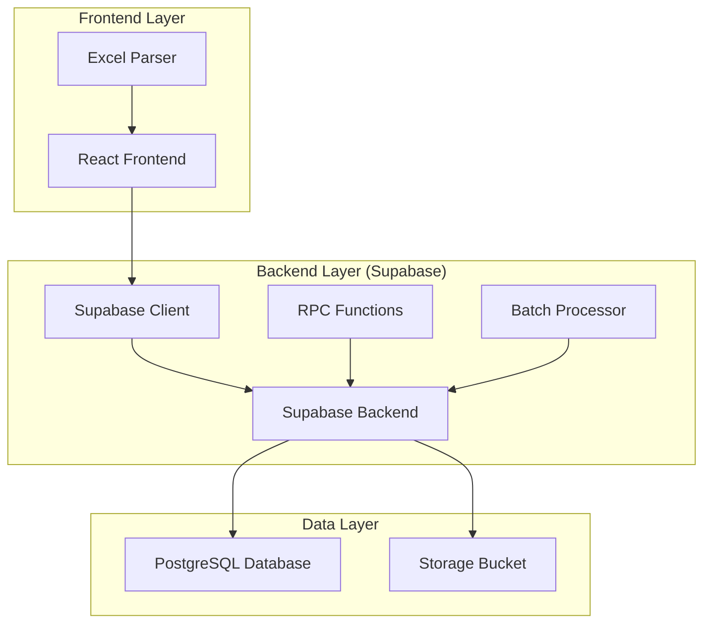
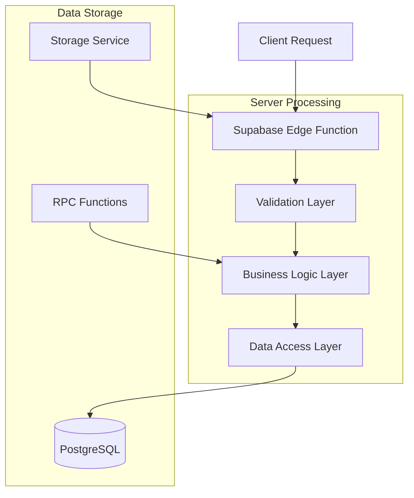
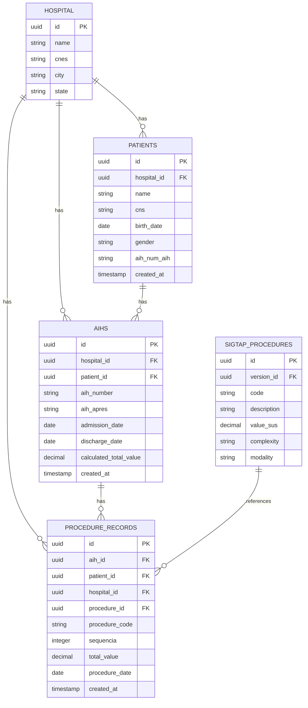
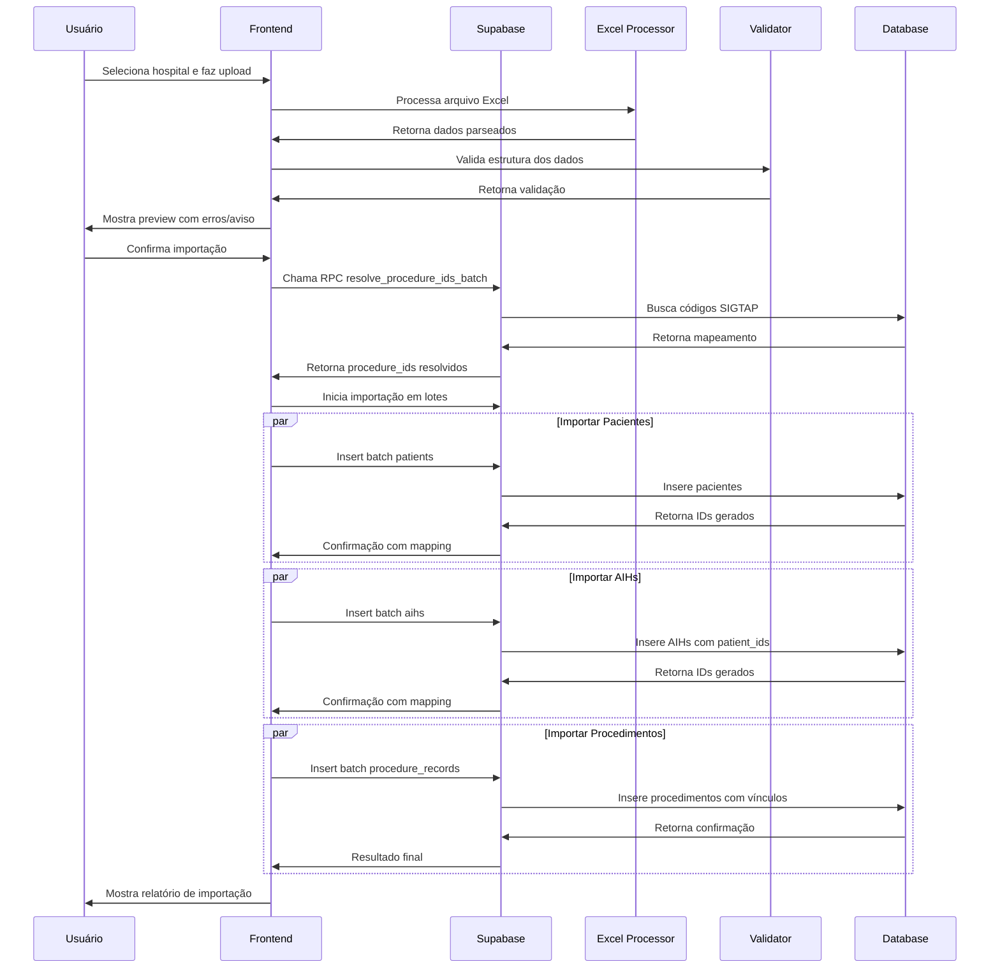

# Arquitetura Técnica - Carga SigtapSync

## 1. Arquitetura Geral do Sistema



## 2. Tecnologias e Dependências

### 2.1 Frontend
- **Framework**: React@18.2.0 com TypeScript
- **Build Tool**: Vite@4.4.0
- **UI Components**: Material-UI@5.14.0
- **Estilização**: TailwindCSS@3.3.0
- **Excel Processing**: SheetJS@0.18.5 (xlsx)
- **Validação**: Yup@1.2.0
- **Notificações**: React-Toastify@9.1.0

### 2.2 Backend (Supabase)
- **Database**: PostgreSQL 15
- **Storage**: Supabase Storage para arquivos Excel
- **Edge Functions**: Deno Runtime para processamento
- **RPC Functions**: PL/pgSQL para operações em lote

### 2.3 Dependências Essenciais

```json
{
  "dependencies": {
    "@supabase/supabase-js": "^2.38.0",
    "react": "^18.2.0",
    "react-dom": "^18.2.0",
    "@mui/material": "^5.14.0",
    "@emotion/react": "^11.11.0",
    "@emotion/styled": "^11.11.0",
    "xlsx": "^0.18.5",
    "date-fns": "^2.30.0",
    "yup": "^1.2.0",
    "react-toastify": "^9.1.0",
    "react-dropzone": "^14.2.0"
  },
  "devDependencies": {
    "@types/react": "^18.2.0",
    "@types/react-dom": "^18.2.0",
    "@vitejs/plugin-react": "^4.0.0",
    "typescript": "^5.0.0",
    "vite": "^4.4.0",
    "tailwindcss": "^3.3.0"
  }
}
```

## 3. Definições de Rotas

| Rota | Componente | Propósito |
|------|------------|-----------|
| `/carga-sigtapsync` | CargaSigtapSyncPage | Página principal de importação |
| `/carga-sigtapsync/upload` | FileUploadComponent | Componente de upload de arquivos |
| `/carga-sigtapsync/preview` | DataPreviewComponent | Preview e validação dos dados |
| `/carga-sigtapsync/matching` | ProcedureMatchingComponent | Resolução de códigos SIGTAP |
| `/carga-sigtapsync/progress` | ImportProgressComponent | Acompanhamento da importação |
| `/carga-sigtapsync/report` | ImportReportComponent | Relatório final com erros e estatísticas |

## 4. Definições de APIs e RPCs

### 4.1 RPC Functions (PostgreSQL)

#### resolve_procedure_ids_batch
```sql
CREATE OR REPLACE FUNCTION public.resolve_procedure_ids_batch(
    p_codes text[],
    p_version_id uuid DEFAULT get_latest_sigtap_version()
)
RETURNS TABLE(code text, procedure_id uuid)
LANGUAGE plpgsql
AS $$
BEGIN
    RETURN QUERY
    SELECT sp.code, sp.id as procedure_id
    FROM sigtap_procedures sp
    WHERE sp.code = ANY(p_codes)
    AND sp.version_id = p_version_id;
END;
$$;
```

#### validate_aih_structure
```sql
CREATE OR REPLACE FUNCTION public.validate_aih_structure(
    p_hospital_id uuid,
    p_aih_number text
)
RETURNS TABLE(is_valid boolean, patient_id uuid, existing_aih_id uuid)
LANGUAGE plpgsql
AS $$
BEGIN
    -- Verifica se AIH já existe e retorna vínculos
    SELECT EXISTS(SELECT 1 FROM aihs WHERE aih_number = p_aih_number AND hospital_id = p_hospital_id),
           patient_id,
           id
    INTO is_valid, patient_id, existing_aih_id
    FROM aihs
    WHERE aih_number = p_aih_number AND hospital_id = p_hospital_id;
    
    RETURN NEXT;
END;
$$;
```

### 4.2 APIs do Frontend

#### Upload e Processamento de Excel
```typescript
// Interface para upload de arquivo
interface UploadResponse {
  file_id: string;
  sheets: {
    patients: number;
    aihs: number;
    procedure_records: number;
  };
  validation_errors: ValidationError[];
}

// Interface para preview de dados
interface DataPreview {
  patients: PatientPreview[];
  aihs: AihPreview[];
  procedureRecords: ProcedureRecordPreview[];
  summary: {
    totalPatients: number;
    totalAihs: number;
    totalProcedures: number;
    criticalErrors: number;
    warnings: number;
  };
}

// Interface para resolução de procedimentos
interface ProcedureResolution {
  resolved: Array<{ code: string; procedure_id: string; description: string }>;
  unresolved: Array<{ code: string; count: number }>;
}
```

### 4.3 Tipos de Dados TypeScript

```typescript
// Tipos principais para frontend e backend
interface Patient {
  name: string;
  cns: string;
  birth_date: string;
  gender: 'M' | 'F';
  address?: string;
  city?: string;
  state?: string;
  zip_code?: string;
  phone?: string;
  medical_record?: string;
  nationality?: string;
  mother_name?: string;
  nome_responsavel?: string;
  race_color?: string;
  bairro?: string;
  numero?: string;
  aih_num_aih: string;
}

interface AIH {
  aih_number: string;
  aih_apres: string;
  procedure_code: string;
  admission_date: string;
  discharge_date: string;
  main_cid?: string;
  procedure_requested?: string;
  discharge_reason?: string;
  specialty?: string;
  care_modality?: string;
  care_character?: string;
  cns_responsavel?: string;
  calculated_total_value?: number;
  patient_id?: string;
}

interface ProcedureRecord {
  procedure_date: string;
  value_charged?: number;
  professional_cbo?: string;
  sequencia: number;
  documento_profissional?: string;
  cnes?: string;
  valor_original?: number;
  porcentagem_sus?: number;
  authorization_number: string;
  procedure_code: string;
  total_value?: number;
  professional_name?: string;
  quantity?: number;
  unit_value?: number;
  care_modality?: string;
  care_character?: string;
  complexity?: string;
  execution_location?: string;
  codigo_procedimento_original?: string;
  procedure_description?: string;
  aih_id?: string;
  patient_id?: string;
  procedure_id?: string;
}

interface ValidationError {
  row: number;
  sheet: string;
  field: string;
  value: any;
  message: string;
  type: 'CRITICAL' | 'WARNING';
  suggestion?: string;
}
```

## 5. Arquitetura do Servidor



## 6. Modelo de Dados

### 6.1 Diagrama ER



### 6.2 Definições DDL

```sql
-- Tabela de Hospitais
CREATE TABLE hospitals (
    id UUID PRIMARY KEY DEFAULT gen_random_uuid(),
    name VARCHAR(255) NOT NULL,
    cnes VARCHAR(20) UNIQUE NOT NULL,
    city VARCHAR(100) NOT NULL,
    state VARCHAR(2) NOT NULL,
    created_at TIMESTAMP WITH TIME ZONE DEFAULT NOW(),
    updated_at TIMESTAMP WITH TIME ZONE DEFAULT NOW()
);

-- Tabela de Pacientes
CREATE TABLE patients (
    id UUID PRIMARY KEY DEFAULT gen_random_uuid(),
    hospital_id UUID NOT NULL REFERENCES hospitals(id) ON DELETE CASCADE,
    name VARCHAR(255) NOT NULL,
    cns VARCHAR(15),
    birth_date DATE NOT NULL,
    gender CHAR(1) CHECK (gender IN ('M', 'F')),
    address TEXT,
    city VARCHAR(100),
    state VARCHAR(2),
    zip_code VARCHAR(8),
    phone VARCHAR(20),
    medical_record VARCHAR(50),
    nationality VARCHAR(50),
    mother_name VARCHAR(255),
    nome_responsavel VARCHAR(255),
    race_color VARCHAR(20),
    bairro VARCHAR(100),
    numero VARCHAR(20),
    aih_num_aih VARCHAR(50) NOT NULL,
    created_at TIMESTAMP WITH TIME ZONE DEFAULT NOW(),
    updated_at TIMESTAMP WITH TIME ZONE DEFAULT NOW()
);

-- Índices para patients
CREATE INDEX idx_patients_hospital_id ON patients(hospital_id);
CREATE INDEX idx_patients_aih_num ON patients(aih_num_aih);
CREATE INDEX idx_patients_cns ON patients(cns);

-- Tabela de AIHs
CREATE TABLE aihs (
    id UUID PRIMARY KEY DEFAULT gen_random_uuid(),
    hospital_id UUID NOT NULL REFERENCES hospitals(id) ON DELETE CASCADE,
    patient_id UUID REFERENCES patients(id) ON DELETE CASCADE,
    aih_number VARCHAR(50) NOT NULL,
    aih_apres VARCHAR(6) NOT NULL,
    procedure_code VARCHAR(10),
    admission_date DATE NOT NULL,
    discharge_date DATE NOT NULL,
    main_cid VARCHAR(10),
    procedure_requested VARCHAR(255),
    discharge_reason VARCHAR(100),
    specialty VARCHAR(100),
    care_modality VARCHAR(50),
    care_character VARCHAR(50),
    cns_responsavel VARCHAR(15),
    calculated_total_value DECIMAL(10,2),
    created_at TIMESTAMP WITH TIME ZONE DEFAULT NOW(),
    updated_at TIMESTAMP WITH TIME ZONE DEFAULT NOW(),
    UNIQUE(hospital_id, aih_number)
);

-- Índices para aihs
CREATE INDEX idx_aihs_hospital_id ON aihs(hospital_id);
CREATE INDEX idx_aihs_patient_id ON aihs(patient_id);
CREATE INDEX idx_aihs_aih_number ON aihs(aih_number);
CREATE INDEX idx_aihs_admission_date ON aihs(admission_date);

-- Tabela de Registros de Procedimentos
CREATE TABLE procedure_records (
    id UUID PRIMARY KEY DEFAULT gen_random_uuid(),
    aih_id UUID NOT NULL REFERENCES aihs(id) ON DELETE CASCADE,
    patient_id UUID REFERENCES patients(id) ON DELETE CASCADE,
    hospital_id UUID NOT NULL REFERENCES hospitals(id) ON DELETE CASCADE,
    procedure_id UUID REFERENCES sigtap_procedures(id),
    procedure_date DATE NOT NULL,
    value_charged DECIMAL(10,2),
    professional_cbo VARCHAR(10),
    sequencia INTEGER NOT NULL DEFAULT 1,
    documento_profissional VARCHAR(50),
    cnes VARCHAR(20),
    valor_original DECIMAL(10,2),
    porcentagem_sus DECIMAL(5,2) DEFAULT 100.00,
    authorization_number VARCHAR(50) NOT NULL,
    procedure_code VARCHAR(10) NOT NULL,
    total_value DECIMAL(10,2),
    professional_name VARCHAR(255),
    quantity INTEGER DEFAULT 1,
    unit_value DECIMAL(10,2),
    care_modality VARCHAR(50),
    care_character VARCHAR(50),
    complexity VARCHAR(50),
    execution_location VARCHAR(100),
    codigo_procedimento_original VARCHAR(10),
    procedure_description TEXT,
    created_at TIMESTAMP WITH TIME ZONE DEFAULT NOW(),
    updated_at TIMESTAMP WITH TIME ZONE DEFAULT NOW()
);

-- Índices para procedure_records
CREATE INDEX idx_procedure_records_aih_id ON procedure_records(aih_id);
CREATE INDEX idx_procedure_records_patient_id ON procedure_records(patient_id);
CREATE INDEX idx_procedure_records_hospital_id ON procedure_records(hospital_id);
CREATE INDEX idx_procedure_records_procedure_id ON procedure_records(procedure_id);
CREATE INDEX idx_procedure_records_procedure_code ON procedure_records(procedure_code);
CREATE INDEX idx_procedure_records_authorization ON procedure_records(authorization_number);
CREATE INDEX idx_procedure_records_sequencia ON procedure_records(sequencia);

-- Permissões RLS (Row Level Security)
ALTER TABLE patients ENABLE ROW LEVEL SECURITY;
ALTER TABLE aihs ENABLE ROW LEVEL SECURITY;
ALTER TABLE procedure_records ENABLE ROW LEVEL SECURITY;

-- Políticas de segurança
CREATE POLICY "Users can view patients from their hospital" ON patients
    FOR SELECT USING (
        hospital_id IN (
            SELECT hospital_id FROM user_hospitals WHERE user_id = auth.uid()
        )
    );

CREATE POLICY "Users can insert patients to their hospital" ON patients
    FOR INSERT WITH CHECK (
        hospital_id IN (
            SELECT hospital_id FROM user_hospitals WHERE user_id = auth.uid()
        )
    );

-- Grant permissions
GRANT SELECT ON patients TO anon;
GRANT INSERT ON patients TO authenticated;
GRANT SELECT ON aihs TO anon;
GRANT INSERT ON aihs TO authenticated;
GRANT SELECT ON procedure_records TO anon;
GRANT INSERT ON procedure_records TO authenticated;
```

## 7. Componentes React Principais

### 7.1 Estrutura de Componentes

```
src/
├── components/
│   ├── CargaSigtapSync/
│   │   ├── FileUpload/
│   │   │   ├── DragDropZone.tsx
│   │   │   ├── FileValidation.tsx
│   │   │   └── UploadProgress.tsx
│   │   ├── DataPreview/
│   │   │   ├── SummaryCards.tsx
│   │   │   ├── DataTable.tsx
│   │   │   └── ErrorList.tsx
│   │   ├── ProcedureMatching/
│   │   │   ├── MatchingTable.tsx
│   │   │   ├── CodeResolver.tsx
│   │   │   └── ExportUnresolved.tsx
│   │   ├── ImportProgress/
│   │   │   ├── ProgressBar.tsx
│   │   │   ├── StepTimeline.tsx
│   │   │   └── CancelButton.tsx
│   │   └── ImportReport/
│   │       ├── ReportSummary.tsx
│   │       ├── ErrorDetails.tsx
│   │       └── ReprocessButton.tsx
├── services/
│   ├── supabase.ts
│   ├── excelProcessor.ts
│   ├── dataValidator.ts
│   └── importService.ts
├── hooks/
│   ├── useFileUpload.ts
│   ├── useDataPreview.ts
│   ├── useProcedureMatching.ts
│   └── useImportProgress.ts
└── utils/
    ├── dateNormalizer.ts
    ├── currencyFormatter.ts
    └── validationHelpers.ts
```

### 7.2 Serviços Principais

```typescript
// Excel Processing Service
class ExcelProcessorService {
  async parseExcel(file: File): Promise<ParsedExcelData> {
    const data = await file.arrayBuffer();
    const workbook = XLSX.read(data, { type: 'array' });
    
    return {
      patients: this.parseSheet(workbook.Sheets['patients']),
      aihs: this.parseSheet(workbook.Sheets['aihs']),
      procedureRecords: this.parseSheet(workbook.Sheets['procedure_records'])
    };
  }
  
  private parseSheet(sheet: XLSX.WorkSheet): any[] {
    return XLSX.utils.sheet_to_json(sheet, {
      defval: null,
      raw: false,
      dateNF: 'yyyy-mm-dd'
    });
  }
}

// Data Validation Service
class DataValidationService {
  validatePatient(data: any): ValidationError[] {
    const errors: ValidationError[] = [];
    
    if (!data.name || data.name.trim().length < 3) {
      errors.push({
        field: 'name',
        message: 'Nome do paciente é obrigatório e deve ter pelo menos 3 caracteres',
        type: 'CRITICAL'
      });
    }
    
    if (data.birth_date) {
      const normalizedDate = DateNormalizer.normalize(data.birth_date);
      if (!normalizedDate) {
        errors.push({
          field: 'birth_date',
          message: 'Data de nascimento inválida',
          type: 'CRITICAL'
        });
      }
    }
    
    return errors;
  }
}

// Import Service
class ImportService {
  async importData(data: ParsedExcelData, hospitalId: string): Promise<ImportResult> {
    const result: ImportResult = {
      patients: { imported: 0, errors: [] },
      aihs: { imported: 0, errors: [] },
      procedureRecords: { imported: 0, errors: [] }
    };
    
    // Etapa 1: Importar pacientes
    result.patients = await this.importPatients(data.patients, hospitalId);
    
    // Etapa 2: Importar AIHs
    result.aihs = await this.importAihs(data.aihs, hospitalId, result.patients.mapping);
    
    // Etapa 3: Resolver códigos SIGTAP
    const procedureMapping = await this.resolveProcedureCodes(
      data.procedureRecords.map(pr => pr.procedure_code)
    );
    
    // Etapa 4: Importar registros de procedimentos
    result.procedureRecords = await this.importProcedureRecords(
      data.procedureRecords,
      hospitalId,
      result.aihs.mapping,
      procedureMapping
    );
    
    return result;
  }
}
```

## 8. Processo de Importação Detalhado

### 8.1 Fluxo de Processamento



### 8.2 Tratamento de Erros e Rollback

```typescript
class ImportTransactionManager {
  private transactionId: string;
  private operations: Array<() => Promise<void>> = [];
  
  async executeWithRollback(importFn: () => Promise<void>): Promise<void> {
    try {
      await importFn();
    } catch (error) {
      console.error('Import failed, executing rollback:', error);
      await this.rollback();
      throw error;
    }
  }
  
  private async rollback(): Promise<void> {
    // Executa operações de rollback em ordem reversa
    for (const operation of this.operations.reverse()) {
      try {
        await operation();
      } catch (rollbackError) {
        console.error('Rollback operation failed:', rollbackError);
      }
    }
  }
  
  addRollbackOperation(operation: () => Promise<void>): void {
    this.operations.push(operation);
  }
}
```

## 9. Performance e Otimização

### 9.1 Estratégias de Batch Processing

```typescript
// Batch processing configuration
const BATCH_CONFIG = {
  PATIENTS: 1000,
  AIHS: 500,
  PROCEDURE_RECORDS: 2000,
  RETRY_ATTEMPTS: 3,
  RETRY_DELAY: 1000
};

class BatchProcessor {
  async processInBatches<T>(
    items: T[],
    batchSize: number,
    processFn: (batch: T[]) => Promise<void>
  ): Promise<void> {
    for (let i = 0; i < items.length; i += batchSize) {
      const batch = items.slice(i, i + batchSize);
      
      await this.retryWithBackoff(
        () => processFn(batch),
        BATCH_CONFIG.RETRY_ATTEMPTS,
        BATCH_CONFIG.RETRY_DELAY
      );
      
      // Progress update
      this.updateProgress(i + batch.length, items.length);
    }
  }
  
  private async retryWithBackoff<T>(
    fn: () => Promise<T>,
    attempts: number,
    delay: number
  ): Promise<T> {
    for (let attempt = 1; attempt <= attempts; attempt++) {
      try {
        return await fn();
      } catch (error) {
        if (attempt === attempts) throw error;
        
        console.warn(`Attempt ${attempt} failed, retrying in ${delay}ms...`);
        await new Promise(resolve => setTimeout(resolve, delay));
        delay *= 2; // Exponential backoff
      }
    }
    
    throw new Error('Max retry attempts reached');
  }
}
```

### 9.2 Caching e Memoização

```typescript
class ProcedureCodeCache {
  private cache = new Map<string, { procedure_id: string; description: string }>();
  private cacheExpiry = 5 * 60 * 1000; // 5 minutes
  
  async getCachedProcedureCodes(codes: string[]): Promise<Map<string, string>> {
    const uncachedCodes = codes.filter(code => !this.cache.has(code));
    
    if (uncachedCodes.length > 0) {
      const resolvedCodes = await this.resolveProcedureCodes(uncachedCodes);
      this.updateCache(resolvedCodes);
    }
    
    const result = new Map<string, string>();
    codes.forEach(code => {
      const cached = this.cache.get(code);
      if (cached) {
        result.set(code, cached.procedure_id);
      }
    });
    
    return result;
  }
  
  private updateCache(codes: Array<{ code: string; procedure_id: string; description: string }>): void {
    codes.forEach(item => {
      this.cache.set(item.code, {
        procedure_id: item.procedure_id,
        description: item.description
      });
    });
    
    // Set expiry timer
    setTimeout(() => {
      this.cache.clear();
    }, this.cacheExpiry);
  }
}
```

## 10. Segurança e Validação

### 10.1 Validações de Input

```typescript
// Input validation schemas
import * as yup from 'yup';

const patientSchema = yup.object({
  name: yup.string()
    .required('Nome é obrigatório')
    .min(3, 'Nome deve ter pelo menos 3 caracteres')
    .max(255, 'Nome muito longo'),
  
  cns: yup.string()
    .matches(/^\d{15}$/, 'CNS deve ter 15 dígitos')
    .nullable(),
  
  birth_date: yup.date()
    .required('Data de nascimento é obrigatória')
    .max(new Date(), 'Data de nascimento não pode ser futura'),
  
  gender: yup.string()
    .oneOf(['M', 'F'], 'Gênero deve ser M ou F')
    .required('Gênero é obrigatório'),
  
  aih_num_aih: yup.string()
    .required('Número da AIH é obrigatório')
    .matches(/^\d+$/, 'AIH deve conter apenas números')
});

const aihSchema = yup.object({
  aih_number: yup.string()
    .required('Número da AIH é obrigatório')
    .matches(/^\d+$/, 'AIH deve conter apenas números'),
  
  aih_apres: yup.string()
    .required('Apresentação da AIH é obrigatória')
    .matches(/^\d{6}$/, 'Apresentação deve ter 6 dígitos (AAAAMM)'),
  
  admission_date: yup.date()
    .required('Data de admissão é obrigatória'),
  
  discharge_date: yup.date()
    .required('Data de alta é obrigatória')
    .min(yup.ref('admission_date'), 'Data de alta deve ser posterior à admissão')
});
```

### 10.2 Sanitização de Dados

```typescript
class DataSanitizer {
  static sanitizeString(input: string): string {
    return input
      .trim()
      .replace(/[<>\"'&]/g, '') // Remove caracteres perigosos
      .replace(/\s+/g, ' ') // Normaliza espaços
      .slice(0, 255); // Limita tamanho
  }
  
  static sanitizeDate(input: string | number): string | null {
    const normalized = DateNormalizer.normalize(input);
    if (!normalized) return null;
    
    // Valida se a data está em um range aceitável
    const date = new Date(normalized);
    const minDate = new Date('1900-01-01');
    const maxDate = new Date();
    
    if (date < minDate || date > maxDate) {
      return null;
    }
    
    return normalized;
  }
  
  static sanitizeCurrency(input: string | number): number {
    if (typeof input === 'string') {
      // Remove caracteres não numéricos exceto vírgula e ponto
      const cleaned = input.replace(/[^0-9,.-]/g, '');
      // Converte vírgula para ponto decimal
      const normalized = cleaned.replace(',', '.');
      return parseFloat(normalized) || 0;
    }
    
    return typeof input === 'number' ? input : 0;
  }
}
```

## 11. Monitoramento e Logs

### 11.1 Estrutura de Logs

```typescript
interface ImportLog {
  id: string;
  user_id: string;
  hospital_id: string;
  file_name: string;
  file_size: number;
  started_at: Date;
  completed_at?: Date;
  status: 'STARTED' | 'IN_PROGRESS' | 'COMPLETED' | 'FAILED' | 'CANCELLED';
  summary: {
    patients: { total: number; imported: number; errors: number };
    aihs: { total: number; imported: number; errors: number };
    procedures: { total: number; imported: number; errors: number };
  };
  error_log?: ValidationError[];
}

class ImportLogger {
  async logStart(userId: string, hospitalId: string, file: File): Promise<string> {
    const logId = generateUUID();
    
    await supabase.from('import_logs').insert({
      id: logId,
      user_id: userId,
      hospital_id: hospitalId,
      file_name: file.name,
      file_size: file.size,
      started_at: new Date(),
      status: 'STARTED'
    });
    
    return logId;
  }
  
  async logProgress(logId: string, progress: ImportProgress): Promise<void> {
    await supabase.from('import_logs').update({
      status: progress.status,
      summary: progress.summary,
      updated_at: new Date()
    }).eq('id', logId);
  }
  
  async logCompletion(logId: string, result: ImportResult): Promise<void> {
    await supabase.from('import_logs').update({
      status: 'COMPLETED',
      completed_at: new Date(),
      summary: result.summary,
      error_log: result.errors
    }).eq('id', logId);
  }
}
```

## 12. Testes e Qualidade

### 12.1 Estratégia de Testes

```typescript
// Testes unitários para validação
describe('DataValidator', () => {
  it('should validate patient data correctly', () => {
    const validPatient = {
      name: 'João da Silva',
      birth_date: '1990-01-15',
      gender: 'M',
      aih_num_aih: '123456789'
    };
    
    const errors = DataValidator.validatePatient(validPatient);
    expect(errors).toHaveLength(0);
  });
  
  it('should detect invalid dates', () => {
    const invalidPatient = {
      name: 'João da Silva',
      birth_date: 'invalid-date',
      gender: 'M',
      aih_num_aih: '123456789'
    };
    
    const errors = DataValidator.validatePatient(invalidPatient);
    expect(errors).toContainEqual(
      expect.objectContaining({
        field: 'birth_date',
        type: 'CRITICAL'
      })
    );
  });
});

// Testes de integração para importação
describe('ImportService', () => {
  it('should import data in correct order', async () => {
    const mockData = createMockExcelData();
    const result = await importService.importData(mockData, 'hospital-123');
    
    expect(result.patients.imported).toBeGreaterThan(0);
    expect(result.aihs.imported).toBeGreaterThan(0);
    expect(result.procedureRecords.imported).toBeGreaterThan(0);
  });
  
  it('should handle rollback on failure', async () => {
    const mockData = createMockExcelDataWithErrors();
    
    await expect(
      importService.importData(mockData, 'hospital-123')
    ).rejects.toThrow();
    
    // Verify rollback was executed
    const patients = await supabase.from('patients').select('*');
    expect(patients.data).toHaveLength(0);
  });
});
```

### 12.2 Métricas de Performance

- **Tempo de Upload**: < 10 segundos para arquivos até 50MB
- **Processamento**: 1000 linhas/segundo para validação
- **Importação**: 5000 registros/segundo em batch
- **Memory Usage**: < 500MB para arquivos até 100k linhas
- **Error Rate**: < 0.1% em dados válidos

Este documento fornece a arquitetura técnica completa para implementação da tela de Carga SigtapSync, incluindo todos os componentes, serviços e processos necessários para importação eficiente e confiável de dados de AIHs com tratamento de procedimentos múltiplos e sequenciais.