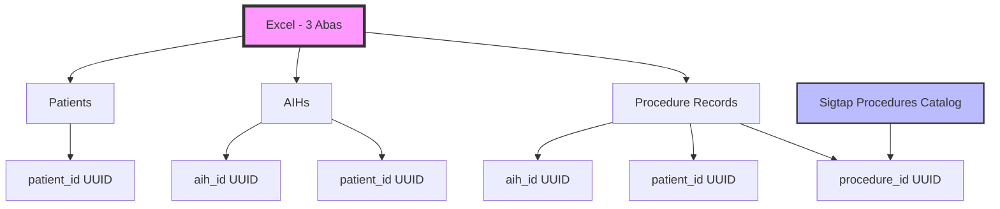

# Análise Técnica - Carga SigtapSync com Importação Excel

## 1. Visão Geral do Processo de Carga

O sistema SigtapSync implementa um pipeline robusto para importação de dados de AIHs (Autorização de Internação Hospitalar) através de arquivos Excel, aplicando regras complexas de negócio para procedimentos múltiplos e sequenciais, com normalização de dados e resolução automática de vínculos entre entidades.

## 2. Arquitetura do Pipeline de Carga

### 2.1 Estrutura de Dados e Relacionamentos



### 2.2 Ordem de Processamento

1. **Patients**: Inserção inicial sem IDs temporários
2. **AIHs**: Associação com patients via `aih_number` → `aih_num_aih`
3. **Procedure Records**: Resolução de vínculos via RPC batch e inserção final

## 3. Regras de Procedimentos Múltiplos e Sequenciais

### 3.1 Identificação de Procedimentos Múltiplos

- **Código Principal**: `procedure_code` na tabela `procedure_records`
- **Vínculo AIH**: Via `authorization_number` ou `aih_number`
- **Sequência**: Campo `sequencia` indica ordem de execução
- **Quantidade**: Campo `quantity` para procedimentos repetitivos

### 3.2 Cálculo de Valores para Procedimentos Múltiplos

```sql
-- Fórmula de cálculo do valor total
-- total_value = unit_value * quantity * porcentagem_sus / 100

-- Exemplo de cálculo com porcentagem SUS
UPDATE procedure_records 
SET total_value = unit_value * quantity * (COALESCE(porcentagem_sus, 100) / 100.0)
WHERE procedure_code = '0408050063' 
AND authorization_number = '123456789';
```

### 3.3 Regras de Sequenciamento

- **Sequência 1**: Procedimento principal (geralmente de maior valor)
- **Sequência 2-N**: Procedimentos auxiliares/secundários
- **Validação**: Soma dos valores não pode exceder `calculated_total_value` da AIH
- **Rateio**: Diferença distribuída proporcionalmente aos valores unitários

## 4. Normalização e Validação de Dados

### 4.1 Normalização de Datas

```javascript
// Função de normalização de datas
function normalizeDate(dateValue) {
    // Formatos aceitos: DD/MM/YYYY, YYYYMMDD, YYYYMM, serial Excel
    if (typeof dateValue === 'number') {
        // Serial Excel (dias desde 1900-01-01)
        const excelEpoch = new Date(1900, 0, 1);
        return new Date(excelEpoch.getTime() + (dateValue - 2) * 24 * 60 * 60 * 1000);
    }
    
    if (typeof dateValue === 'string') {
        // DD/MM/YYYY
        if (dateValue.match(/^\d{2}\/\d{2}\/\d{4}$/)) {
            const [day, month, year] = dateValue.split('/');
            return `${year}-${month}-${day}`;
        }
        
        // YYYYMMDD
        if (dateValue.match(/^\d{8}$/)) {
            return `${dateValue.substr(0,4)}-${dateValue.substr(4,2)}-${dateValue.substr(6,2)}`;
        }
        
        // YYYYMM (para aih_apres)
        if (dateValue.match(/^\d{6}$/)) {
            return `${dateValue.substr(0,4)}-${dateValue.substr(4,2)}-01`;
        }
    }
    
    return dateValue;
}
```

### 4.2 Normalização de Números

```javascript
// Função de normalização de valores monetários
function normalizeCurrency(value) {
    if (typeof value === 'string') {
        // Remove pontos de milhar e converte vírgula para ponto
        // 1.234,56 → 1234.56
        return parseFloat(value.replace(/\./g, '').replace(',', '.'));
    }
    return parseFloat(value) || 0;
}
```

### 4.3 Validação de Códigos SIGTAP

```javascript
// Validação e formatação de códigos
function normalizeProcedureCode(code) {
    // Preserva zeros à esquerda, remove caracteres especiais
    return code.toString().replace(/[^0-9]/g, '').padStart(10, '0');
}
```

## 5. Resolução de Vínculos via RPC Batch

### 5.1 Processo de Resolução

```javascript
// Código para resolver múltiplos procedimentos de uma vez
async function resolveProcedureIdsBatch(procedureCodes, versionId) {
    const { data, error } = await supabase
        .rpc('resolve_procedure_ids_batch', {
            p_codes: procedureCodes,
            p_version_id: versionId || getLatestSigtapVersion()
        });
    
    if (error) throw error;
    
    // Mapeamento código → ID
    const procedureCodeToId = {};
    data.forEach(item => {
        procedureCodeToId[item.code] = item.procedure_id;
    });
    
    return procedureCodeToId;
}
```

### 5.2 Tratamento de Códigos Não Resolvidos

```javascript
// Validação antes da inserção
function validateProcedureRecord(record, procedureCodeToId) {
    const errors = [];
    
    // Verifica se o código foi resolvido
    if (!procedureCodeToId[record.procedure_code]) {
        errors.push(`Código ${record.procedure_code} não encontrado no catálogo SIGTAP`);
    }
    
    // Verifica vínculo com AIH
    if (!record.aih_id && !record.authorization_number) {
        errors.push('Nenhuma AIH de referência fornecida');
    }
    
    // Verifica vínculo com paciente
    if (!record.patient_id) {
        errors.push('Paciente não vinculado');
    }
    
    return errors;
}
```

## 6. Cálculos de Valores e Rateios

### 6.1 Cálculo do Valor Total da AIH

```sql
-- Soma de todos os procedimentos vinculados à AIH
SELECT 
    aih_id,
    SUM(total_value) as sum_procedures,
    calculated_total_value,
    calculated_total_value - SUM(total_value) as difference
FROM procedure_records pr
JOIN aihs a ON pr.aih_id = a.id
GROUP BY aih_id, calculated_total_value;
```

### 6.2 Rateio de Diferenças

```javascript
// Rateio proporcional da diferença entre procedimentos
function distributeDifference(aihId, totalDifference) {
    const procedures = getProceduresByAih(aihId);
    const totalValue = procedures.reduce((sum, proc) => sum + proc.total_value, 0);
    
    procedures.forEach((proc, index) => {
        const proportion = proc.total_value / totalValue;
        const adjustment = totalDifference * proportion;
        
        // Aplica ajustamento
        proc.total_value += adjustment;
        proc.adjustment_reason = 'Rateio de diferença SUS';
        
        // Atualiza no banco
        updateProcedureRecord(proc.id, { 
            total_value: proc.total_value,
            adjustment_reason: proc.adjustment_reason 
        });
    });
}
```

## 7. Tratamento de Erros e Validações

### 7.1 Erros Críticos (Bloqueiam Inserção)

- **Data inválida**: Impossível converter para formato PostgreSQL
- **AIH não resolvida**: Nenhuma correspondência encontrada
- **Procedimento não catalogado**: Código SIGTAP inválido
- **Vínculo paciente-AIH quebrado**: Inconsistência nos dados

### 7.2 Avisos (Não Bloqueiam)

- **Campos opcionais vazios**: porcentagem_sus, complexidade, etc.
- **Valores zerados**: unit_value ou quantity igual a zero
- **Sequências duplicadas**: Mesmo procedimento com mesma sequência
- **Diferenças de valores**: Soma dos procedimentos ≠ valor total AIH

### 7.3 Estrutura de Log de Erros

```javascript
const errorLog = {
    row_number: 123,
    sheet_name: 'procedure_records',
    error_type: 'CRITICAL',
    error_message: 'Código 0408050063 não encontrado no catálogo',
    field_name: 'procedure_code',
    field_value: '0408050063',
    resolution: 'Verificar código no catálogo SIGTAP'
};
```

## 8. Performance e Otimização

### 8.1 Batch Processing

```javascript
// Processamento em lotes para melhor performance
const BATCH_SIZE = 1000;

async function processBatch(records, batchProcessor) {
    const results = [];
    
    for (let i = 0; i < records.length; i += BATCH_SIZE) {
        const batch = records.slice(i, i + BATCH_SIZE);
        const batchResults = await batchProcessor(batch);
        results.push(...batchResults);
        
        // Atualiza progresso
        updateProgress(i + batch.length, records.length);
    }
    
    return results;
}
```

### 8.2 Índices Recomendados

```sql
-- Índices para otimização das queries
CREATE INDEX idx_procedure_records_aih_id ON procedure_records(aih_id);
CREATE INDEX idx_procedure_records_procedure_code ON procedure_records(procedure_code);
CREATE INDEX idx_procedure_records_authorization ON procedure_records(authorization_number);
CREATE INDEX idx_aihs_aih_number ON aihs(aih_number);
CREATE INDEX idx_patients_aih_num ON patients(aih_num_aih);
CREATE INDEX idx_sigtap_procedures_code ON sigtap_procedures(code, version_id);
```

## 9. Interface de Usuário - Status e Matching

### 9.1 Componente de Preview de Dados

```javascript
// Estrutura de dados para exibição do preview
const previewData = {
    summary: {
        totalPatients: 150,
        totalAihs: 200,
        totalProcedures: 850,
        errors: 12,
        warnings: 45
    },
    procedureMatching: [
        {
            code: '0408050063',
            description: 'CIRURGIA BARIÁTRICA',
            status: 'RESOLVED',
            procedureId: 'uuid-123',
            count: 25
        },
        {
            code: '0303010060',
            description: 'CÓDIGO NÃO ENCONTRADO',
            status: 'UNRESOLVED',
            procedureId: null,
            count: 3
        }
    ],
    aihLinking: [
        {
            aihNumber: '123456789',
            patientFound: true,
            proceduresCount: 5,
            totalValue: 15420.50
        }
    ]
};
```

### 9.2 Progresso por Etapa

1. **Validação de Estrutura** (0-10%)
2. **Processamento de Patients** (10-40%)
3. **Processamento de AIHs** (40-70%)
4. **Resolução de Procedimentos** (70-85%)
5. **Inserção de Procedure Records** (85-100%)

## 10. Exemplos de Cálculos Complexos

### 10.1 Caso: Procedimentos Múltiplos com Rateio

```
AIH: 123456789
Valor Total AIH: R$ 15.420,50
Procedimentos:
- Seq 1: 0408050063 (Cirurgia Bariátrica) - Valor: R$ 12.000,00
- Seq 2: 0303010060 (Acompanhamento) - Valor: R$ 2.000,00
- Seq 3: 0202010044 (Consulta) - Valor: R$ 1.000,00
Soma: R$ 15.000,00
Diferença: R$ 420,50

Rateio:
- Proporção Seq 1: 12.000/15.000 = 80% → Ajuste: R$ 336,40
- Proporção Seq 2: 2.000/15.000 = 13,33% → Ajuste: R$ 56,07
- Proporção Seq 3: 1.000/15.000 = 6,67% → Ajuste: R$ 28,03

Valores Finais:
- Seq 1: R$ 12.336,40
- Seq 2: R$ 2.056,07
- Seq 3: R$ 1.028,03
Total: R$ 15.420,50 ✓
```

### 10.2 Caso: Procedimentos com Quantidade

```
Procedimento: 0408040060 (Cirurgia)
Quantidade: 3
Valor Unitário: R$ 1.500,00
Porcentagem SUS: 85%

Cálculo:
Valor Total = 1.500,00 × 3 × 0,85 = R$ 3.825,00
```

## 11. Boas Práticas e Recomendações

### 11.1 Validações de Integridade

- Sempre verificar se a soma dos procedimentos está coerente com o valor total da AIH
- Validar sequências únicas por AIH
- Garantir que não existam procedimentos órfãos (sem AIH vinculada)
- Verificar consistência de datas (procedimentos dentro do período da AIH)

### 11.2 Tratamento de Exceções

- Implementar rollback em caso de falha crítica
- Manter log detalhado de todas as operações
- Permitir reprocessamento de arquivos com correções
- Gerar relatório de inconsistências para auditoria

### 11.3 Performance

- Usar transações para garantir atomicidade
- Implementar índices apropriados
- Processar em lotes para grandes volumes
- Cache de catálogo SIGTAP para evitar múltiplas consultas