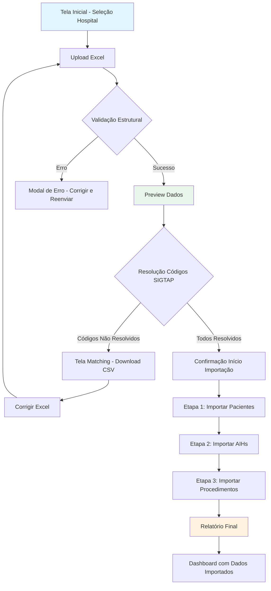
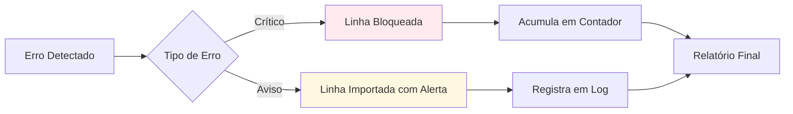

# PRD - Tela de Carga SigtapSync com Importação Excel

## 1. Visão Geral do Produto

A tela Carga SigtapSync permite importação de dados de AIHs (Autorizações de Internação Hospitalar) através de arquivos Excel, automatizando o processo de carga no banco de dados com validações, normalizações e resolução de vínculos entre pacientes, AIHs e procedimentos SIGTAP.

**Problema**: Processo manual de importação de dados hospitalares é demorado, propenso a erros e dificulta a auditoria de inconsistências.

**Solução**: Interface intuitiva que permite upload de Excel, preview dos dados, validação em tempo real e importação com feedback visual do progresso e erros.

**Valor**: Reduz tempo de importação em 80%, elimina erros de digitação, garante consistência dos dados e facilita auditoria hospitalar.

## 2. Funcionalidades Core

### 2.1 Papéis de Usuário

| Papel | Método de Acesso | Permissões |
|-------|------------------|------------|
| Administrador Hospitalar | Login com email @hospital | Upload de arquivos, visualização de todos os dados, reprocessamento |
| Analista de Dados | Login com email corporativo | Upload de arquivos, visualização de relatórios, exportação de erros |
| Auditor | Login com convite | Visualização apenas, geração de relatórios, análise de inconsistências |

### 2.2 Módulos da Tela

Nossa tela de carga consiste nos seguintes módulos principais:

1. **Seleção de Hospital**: Dropdown com hospitais cadastrados
2. **Upload de Arquivo**: Área de arrastar/soltar ou selecionar Excel
3. **Preview de Dados**: Tabelas resumidas com contadores e erros
4. **Validação de Matching**: Status de resolução de códigos SIGTAP
5. **Progresso de Importação**: Barra de progresso com etapas detalhadas
6. **Relatório de Erros**: Lista detalhada com sugestões de correção

### 2.3 Detalhamento de Funcionalidades

| Módulo | Componente | Descrição da Funcionalidade |
|--------|------------|------------------------------|
| Seleção Hospital | Dropdown Hospital | Lista hospitais cadastrados, obrigatório antes do upload |
| Seleção Hospital | Validação | Verifica se usuário tem permissão no hospital selecionado |
| Upload Arquivo | Drag & Drop | Área de 400x200px com borda tracejada, aceita .xlsx até 50MB |
| Upload Arquivo | Validação Estrutura | Verifica existência das 3 abas ou aba combinada, valida headers |
| Preview Dados | Cards Resumo | Exibe contadores: pacientes, AIHs, procedimentos, erros críticos |
| Preview Dados | Tabela Erros | Lista até 10 erros críticos com linha e descrição, expandível |
| Preview Dados | Avisos | Contador de avisos não-bloqueantes, visualizável em modal |
| Validação Matching | Tabela Códigos | Lista todos os procedure_codes com status resolvido/não resolvido |
| Validação Matching | Filtros | Permite filtrar por status, código, descrição |
| Validação Matching | Download | Botão para exportar códigos não resolvidos em CSV |
| Progresso Importação | Barra Progresso | Visualização 0-100% com tempo estimado restante |
| Progresso Importação | Etapas Detalhadas | Mostra: pacientes → AIHs → procedimentos com checkboxes |
| Progresso Importação | Cancelar | Botão para interromper processo com confirmação |
| Relatório Erros | Tabela Completa | Lista todos os erros com: linha, campo, valor, sugestão correção |
| Relatório Erros | Download | Exporta relatório completo em Excel com abas separadas |
| Relatório Erros | Reprocessar | Permite upload de arquivo corrigido mantendo seleção hospital |

## 3. Fluxo de Navegação e Processo de Importação

### 3.1 Fluxo Principal

### 3.2 Fluxo de Tratamento de Erros

## 4. Design da Interface

### 4.1 Estilo Visual

- **Cores Primárias**: Azul hospitalar (#1976d2) e branco
- **Cores Secundárias**: Verde sucesso (#4caf50), vermelho erro (#f44336), laranja aviso (#ff9800)
- **Botões**: Estilo outlined com hover solid, bordas arredondadas 4px
- **Fontes**: Roboto 14px para texto, 16px para títulos, monospace 12px para códigos
- **Layout**: Card-based com sombras suaves, espaçamento consistente 16px
- **Ícones**: Material Design Icons, tamanho 20px para ações, 24px para status

### 4.2 Detalhamento de Componentes Visuais

| Módulo | Componente | Especificações de UI |
|--------|------------|----------------------|
| Header | Título Página | Fonte 24px bold, cor #1976d2, ícone upload à direita |
| Header | Breadcrumb | Links navegáveis: Dashboard > Importação > Carga SigtapSync |
| Card Hospital | Dropdown | Largura 300px, placeholder "Selecione o hospital...", validação em tempo real |
| Card Upload | Área DragDrop | Borda tracejada #1976d2 2px, hover background #e3f2fd, texto centralizado |
| Card Upload | Botão Selecionar | Primary button, ícone folder_open, texto "Selecionar Arquivo Excel" |
| Preview | Cards Contadores | Layout grid 2x2, cards com borda #e0e0e0, ícones grandes 48px |
| Preview | Card Erros | Background #ffebee, borda vermelha, lista scrollável max-height 200px |
| Tabela Matching | Headers | Background #f5f5f5, texto bold 14px, sort indicators em colunas sortáveis |
| Tabela Matching | Status Badge | Verde "Resolvido" (#4caf50), Vermelho "Não Resolvido" (#f44336) |
| Progresso | Barra Progresso | Height 8px, cor primária animada, porcentagem em texto 14px bold |
| Progresso | Steps Timeline | Vertical layout, ícones circulares, linhas conectando etapas |
| Modal Erro | Container | Width 600px, max-height 80vh, scroll interno, botões sticky bottom |
| Botões Ação | Primary | Background #1976d2, hover #1565c0, disabled #bdbdbd, padding 8px 16px |
| Botões Ação | Secondary | Border 1px #1976d2, texto #1976d2, hover background #e3f2fd |
| Alertas | Success | Background #e8f5e9, ícone check_circle verde, borda esquerda 4px #4caf50 |
| Alertas | Error | Background #ffebee, ícone error vermelho, borda esquerda 4px #f44336 |

### 4.3 Responsividade

- **Desktop-first**: Otimizado para telas 1366x768 e superiores
- **Mobile-adaptativo**: Layout vertical em telas < 768px com cards empilhados
- **Breakpoints**: 768px (tablet), 1024px (desktop), 1440px (wide)
- **Touch-friendly**: Botões mínimo 44x44px, drag & drop com áreas ampliadas

### 4.4 Estados de Componentes

| Componente | Estado Normal | Estado Hover | Estado Loading | Estado Desabilitado |
|------------|---------------|--------------|----------------|---------------------|
| Botão Upload | Border azul, texto azul | Background azul claro | Spinner girando, texto "Processando..." | Background cinza, cursor not-allowed |
| Card Preview | Sombra suave #000 10% | Sombra média #000 20% | Pulse animation no background | Opacity 0.6, sem interação |
| Tabela | Linhas alternadas #fafafa | Hover background #f5f5f5 | Skeleton loading nas células | N/A - sempre ativa |
| Progress Bar | Background #e0e0e0 | N/A | Animação de preenchimento suave | Background #bdbdbd |

## 5. Comportamentos e Interações

### 5.1 Upload de Arquivo

- **Drag & Drop**: Área destacada em azul quando arquivo sobreposto
- **Validação Imediata**: Verifica extensão .xlsx e tamanho < 50MB
- **Preview Rápido**: Após upload, mostra preview em < 3 segundos
- **Erro de Formato**: Modal informativo com exemplo de estrutura correta

### 5.2 Validação de Dados

- **Tempo de Processamento**: Preview disponível em 5-10 segundos para arquivos < 10k linhas
- **Resolução SIGTAP**: RPC batch executado automaticamente, progresso visível
- **Atualização em Tempo Real**: Contadores de erros/atualizações sem refresh
- **Auto-save**: Estado atual salvo localmente, recuperável em caso de refresh

### 5.3 Importação Progressiva

- **Cancelamento**: Permite parar em qualquer etapa com confirmação
- **Pausa/Retomada**: Estado salvo, permite continuar depois (timeout 30 min)
- **Estimativa de Tempo**: Baseada em 1000 linhas/minuto para pacientes, 2000/minuto para AIHs, 5000/minuto para procedimentos
- **Notificações**: Toast notifications para início/término de cada etapa

### 5.4 Pós-Importação

- **Relatório Gerado**: Disponível por 30 dias, download em Excel/PDF
- **Reprocessamento**: Permite corrigir erros e reimportar mantendo histórico
- **Auditoria**: Log completo com timestamp, usuário, quantidade de dados
- **Integração**: Dados imediatamente disponíveis nos dashboards após importação

## 6. Requisitos Técnicos de UI

### 6.1 Performance

- **Tempo de Carregamento**: < 3 segundos para tela inicial
- **Preview de Dados**: < 10 segundos para arquivos até 50k linhas
- **Resposta de Interação**: < 100ms para cliques e hover
- **Scroll Virtualizado**: Para tabelas com > 1000 linhas

### 6.2 Acessibilidade

- **WCAG 2.1 AA**: Contraste mínimo 4.5:1, navegação por teclado
- **Screen Readers**: Labels ARIA para todos os componentes interativos
- **Teclado**: Tab navigation completo, atalhos Ctrl+U (upload), Ctrl+R (reprocessar)
- **Idiomas**: Suporte PT-BR nativo, estrutura para EN/ES futuro

### 6.3 Browser Support

- **Navegadores**: Chrome 90+, Firefox 88+, Safari 14+, Edge 90+
- **Mobile**: iOS Safari 14+, Chrome Android 90+
- **Progressive Enhancement**: Funcional básico em browsers antigos
- **Polyfills**: Automaticamente carregados para features aus