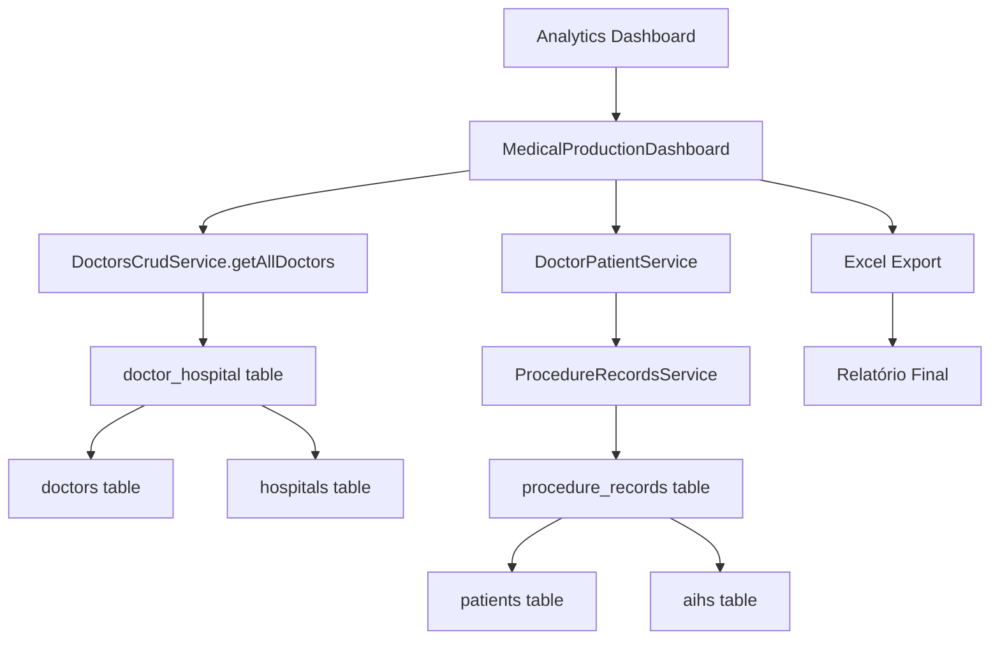

# 🔍 **ANÁLISE SISTEMÁTICA: RELATÓRIO PACIENTES GERAL**
## Arquitetura de Dados e Engenharia de Dados - SIGTAP Sync

---

## 📋 **LOCALIZAÇÃO E CONTEXTO**

**Tela:** Analytics → Aba "Profissionais"  
**Componente:** `MedicalProductionDashboard.tsx` (linhas 1565-1739)  
**Botão:** "Relatório Pacientes Geral" (verde com ícone FileSpreadsheet)  
**Funcionalidade:** Exportação Excel com dados completos de pacientes e procedimentos  

---

## 🏗️ **ARQUITETURA DE DADOS - VISÃO GERAL**

### **📊 Fluxo de Dados Principal**



### **🗄️ Tabelas Envolvidas (5 principais)**

1. **`doctor_hospital`** - Relacionamento médico-hospital
2. **`doctors`** - Cadastro de médicos
3. **`hospitals`** - Cadastro de hospitais
4. **`procedure_records`** - Registros de procedimentos (FONTE PRINCIPAL)
5. **`patients`** - Cadastro de pacientes
6. **`aihs`** - Autorizações de Internação Hospitalar

---

## 🔄 **FLUXO DETALHADO DE CONSUMO DE DADOS**

### **1. 🩺 CARREGAMENTO DOS MÉDICOS**

**Serviço:** `DoctorsCrudService.getAllDoctors()`  
**Arquivo:** `src/services/doctorsCrudService.ts`  

```typescript
// Query principal
let mainQuery = supabase
  .from('doctor_hospital')
  .select(`
    doctor_cns,
    hospital_id,
    role,
    department,
    is_primary_hospital,
    is_active,
    doctors (
      id,
      cns,
      crm,
      name,
      specialty,
      is_active,
      created_at,
      updated_at
    ),
    hospitals (
      id,
      name,
      cnpj
    )
  `);
```

**Estrutura de Dados Resultante:**
```typescript
interface MedicalDoctor {
  id: string;
  cns: string;
  name: string;
  crm: string;
  specialty: string;
  hospitals: string[]; // IDs dos hospitais
  hospitalIds?: string[];
  isActive: boolean;
}
```

### **2. 👥 CARREGAMENTO DOS PACIENTES**

**Serviço:** `DoctorPatientService.getAllDoctorsWithPatients()`  
**Arquivo:** `src/services/doctorPatientService.ts`  

**Estratégia Multi-Step:**
1. Busca médicos via `doctor_hospital`
2. Para cada médico, busca pacientes via `procedure_records`
3. Agrupa pacientes por médico responsável
4. Carrega dados da AIH associada

```typescript
// Query de pacientes por médico
const { data: patientRows, error: patientError } = await supabase
  .from('procedure_records')
  .select(`
    patient_id,
    professional_name,
    professional_cns,
    aih_id,
    patients (
      id,
      name,
      cns,
      birth_date,
      gender,
      medical_record,
      mother_name
    ),
    aihs (
      id,
      aih_number,
      admission_date,
      discharge_date,
      main_cid,
      secondary_cid,
      specialty,
      care_character,
      calculated_total_value
    )
  `)
  .or(`professional_cns.eq.${doctorCns},professional_name.ilike.%${doctorName}%`);
```

### **3. 🔬 CARREGAMENTO DOS PROCEDIMENTOS**

**Serviço:** `ProcedureRecordsService.getAllProcedures()`  
**Arquivo:** `src/services/simplifiedProcedureService.ts`  

**Tabela Principal:** `procedure_records`

```sql
-- Schema da tabela procedure_records
CREATE TABLE procedure_records (
  id UUID PRIMARY KEY DEFAULT gen_random_uuid(),
  hospital_id UUID NOT NULL REFERENCES hospitals(id),
  patient_id UUID NOT NULL REFERENCES patients(id),
  procedure_id UUID NOT NULL REFERENCES sigtap_procedures(id),
  aih_id UUID REFERENCES aihs(id),
  aih_match_id UUID REFERENCES aih_matches(id),
  
  -- Dados do procedimento
  procedure_date TIMESTAMP WITH TIME ZONE NOT NULL,
  procedure_code VARCHAR(20),
  procedure_name VARCHAR(255),
  procedure_description TEXT,
  value_charged INTEGER NOT NULL, -- em centavos
  
  -- Profissional
  professional VARCHAR(255),
  professional_cbo VARCHAR(10),
  professional_cns VARCHAR(15),
  professional_name VARCHAR(255),
  
  -- Status e billing
  billing_status VARCHAR(20) DEFAULT 'pending',
  match_status VARCHAR(20),
  match_confidence INTEGER,
  
  -- Características
  quantity INTEGER DEFAULT 1,
  care_modality VARCHAR(50),
  care_character VARCHAR(10),
  complexity VARCHAR(50),
  
  -- Metadados
  created_at TIMESTAMP WITH TIME ZONE DEFAULT NOW(),
  created_by UUID REFERENCES auth.users(id)
);
```

**Query de Busca (Paginada):**
```typescript
// Busca paginada para evitar timeout
const { data, error } = await supabase
  .from('procedure_records')
  .select('*, procedure_description')
  .range(page * pageSize, (page + 1) * pageSize - 1)
  .order('created_at', { ascending: false });
```

---

## 📊 **ESTRUTURA DOS DADOS NO RELATÓRIO**

### **🔍 Fonte de Dados: `filteredDoctors`**

**Origem:** Estado local do componente `MedicalProductionDashboard`  
**Tipo:** `DoctorWithPatients[]`  

```typescript
interface DoctorWithPatients {
  doctor_info: {
    id: string;
    name: string;
    cns: string;
    crm: string;
    specialty: string;
  };
  hospitals: Array<{
    hospital_id: string;
    hospital_name: string;
  }>;
  patients: Array<{
    patient_info: {
      id: string;
      name: string;
      cns: string;
      birth_date: string;
      gender: 'M' | 'F';
    };
    aih_info: {
      aih_number: string;
      admission_date: string;
      discharge_date: string;
      specialty: string;
      care_character: string;
    };
    total_value_reais: number; // Valor da AIH
    procedures: Array<{
      procedure_code: string;
      procedure_description: string;
      procedure_date: string;
      value_reais: number;
    }>;
  }>;
}
```

### **📋 Colunas do Relatório Excel**

| **Coluna** | **Fonte** | **Transformação** |
|------------|-----------|-------------------|
| **#** | Sequencial | Auto-numeração |
| **Nome do Paciente** | `patient_info.name` | Direto |
| **Nº AIH** | `aih_info.aih_number` | Remove caracteres não numéricos |
| **Código Procedimento** | `procedures[].procedure_code` | Direto |
| **Descrição Procedimento** | `procedures[].procedure_description` | Direto |
| **Data Procedimento** | `procedures[].procedure_date` | Formato DD/MM/YYYY |
| **Data Alta (SUS)** | `aih_info.discharge_date` | Formato DD/MM/YYYY |
| **Especialidade de Atendimento** | `aih_info.specialty` | Direto |
| **Caráter de Atendimento** | `aih_info.care_character` | Via `CareCharacterUtils.formatForDisplay()` |
| **Médico** | `doctor_info.name` | Direto |
| **Hospital** | `hospitals[0].hospital_name` | Primeiro hospital |
| **Valor Procedimento** | `procedures[].value_reais` | Em reais |
| **AIH Seca** | `total_value_reais` | Valor base da AIH |
| **Incremento** | Calculado | Via `computeIncrementForProcedures()` |
| **AIH c/ Incremento** | Calculado | AIH Seca + Incremento |

---

## 🔧 **ENGENHARIA DE DADOS - ANÁLISE TÉCNICA**

### **⚡ Performance e Otimizações**

**1. Paginação Automática:**
```typescript
// ProcedureRecordsService.getAllProcedures()
const pageSize = 1000; // Tamanho seguro por página
while (hasMore) {
  const { data, error } = await supabase
    .from('procedure_records')
    .select('*, procedure_description')
    .range(page * pageSize, (page + 1) * pageSize - 1)
    .order('created_at', { ascending: false });
}
```

**2. Índices Estratégicos:**
```sql
-- Índices existentes para otimização
CREATE INDEX IF NOT EXISTS idx_procedure_records_patient_id 
ON procedure_records(patient_id);

CREATE INDEX IF NOT EXISTS idx_procedure_records_aih_id 
ON procedure_records(aih_id);

CREATE INDEX IF NOT EXISTS idx_procedure_records_professional_cns 
ON procedure_records(professional_cns);

CREATE INDEX IF NOT EXISTS idx_aihs_hospital_discharge_date
ON aihs(hospital_id, discharge_date);
```

**3. Filtros Aplicados:**
```typescript
// Filtro por data de alta (se habilitado)
if (useOnlyEnd && selectedEnd) {
  const discharge = p?.aih_info?.discharge_date ? new Date(p.aih_info.discharge_date) : undefined;
  if (!discharge || !isSameUTCDate(discharge, selectedEnd)) return;
}

// Exclusão de anestesistas (CBO 225151)
const procedures = p.procedures || [];
// Aplicado via filterCalculableProcedures()
```

### **🔄 Real-time e Sincronização**

**Supabase Real-time:**
```typescript
useEffect(() => {
  const channel = supabase
    .channel('medical_production_realtime')
    .on('postgres_changes', {
      event: '*',
      schema: 'public',
      table: 'procedure_records'
    }, (payload) => {
      // Debounce para evitar múltiplas atualizações
      if (realtimeDebounceRef.current) clearTimeout(realtimeDebounceRef.current);
      realtimeDebounceRef.current = setTimeout(() => setRefreshTick((t) => t + 1), 800);
    })
    .subscribe();
}, [autoRefresh, selectedHospitals, dateRange]);
```

### **💾 Caching Strategy**

**1. Estado Local (React):**
- `doctors`: Cache dos médicos carregados
- `filteredDoctors`: Médicos após aplicação de filtros
- `proceduresData`: Cache de procedimentos por AIH

**2. Supabase Built-in:**
- Cache automático de queries no cliente
- Connection pooling no servidor

**3. Browser Cache:**
- React Query para cache de requisições
- LocalStorage para configurações de usuário

---

## 🚨 **PONTOS CRÍTICOS IDENTIFICADOS**

### **⚠️ Performance Issues**

**1. N+1 Query Problem:**
```typescript
// PROBLEMA: Múltiplas queries para cada médico
doctorsData.forEach(doctor => {
  doctor.patients.forEach(patient => {
    // Query separada para cada paciente
    loadAIHProcedures(patient.aih_id);
  });
});
```

**2. Falta de Paginação no Frontend:**
```typescript
// Carrega TODOS os procedimentos de uma vez
const sampleResult = await ProcedureRecordsService.getAllProcedures();
// Pode causar timeout com muitos dados
```

**3. Processamento Síncrono:**
```typescript
// Processamento sequencial dos dados
filteredDoctors.forEach((card: any) => {
  (card.patients || []).forEach((p: any) => {
    // Processamento síncrono pode travar a UI
  });
});
```

### **🔧 Gargalos de Dados**

**1. Tabela `procedure_records`:**
- **Volume:** Potencialmente milhões de registros
- **Queries:** Sem limite adequado
- **Índices:** Podem não cobrir todas as consultas

**2. Joins Complexos:**
```sql
-- Join de 6 tabelas pode ser custoso
doctor_hospital → doctors
              → hospitals  
              → procedure_records → patients
                                → aihs
```

**3. Transformações de Dados:**
```typescript
// Conversões custosas no frontend
const procDateLabel = procDate 
  ? (() => { 
      const s = String(procDate); 
      const m = s.match(/^(\d{4})-(\d{2})-(\d{2})/); 
      return m ? `${m[3]}/${m[2]}/${m[1]}` : formatDateFns(new Date(s), 'dd/MM/yyyy'); 
    })()
  : '';
```

---

## 💡 **RECOMENDAÇÕES DE OTIMIZAÇÃO**

### **🚀 Performance**

**1. Implementar Views Materializadas:**
```sql
CREATE MATERIALIZED VIEW mv_doctor_patients_summary AS
SELECT 
  d.id as doctor_id,
  d.name as doctor_name,
  d.cns as doctor_cns,
  h.id as hospital_id,
  h.name as hospital_name,
  COUNT(DISTINCT p.id) as total_patients,
  COUNT(pr.id) as total_procedures,
  SUM(pr.value_charged) as total_revenue
FROM doctors d
JOIN doctor_hospital dh ON d.cns = dh.doctor_cns
JOIN hospitals h ON dh.hospital_id = h.id
LEFT JOIN procedure_records pr ON pr.professional_cns = d.cns
LEFT JOIN patients p ON pr.patient_id = p.id
WHERE d.is_active = true AND dh.is_active = true
GROUP BY d.id, d.name, d.cns, h.id, h.name;

-- Refresh automático
CREATE OR REPLACE FUNCTION refresh_mv_doctor_patients_summary()
RETURNS TRIGGER AS $$
BEGIN
  REFRESH MATERIALIZED VIEW CONCURRENTLY mv_doctor_patients_summary;
  RETURN NULL;
END;
$$ LANGUAGE plpgsql;
```

**2. Implementar Paginação Virtual:**
```typescript
// React Window para virtualização
import { FixedSizeList as List } from 'react-window';

const VirtualizedDoctorList = ({ doctors }) => (
  <List
    height={600}
    itemCount={doctors.length}
    itemSize={120}
    itemData={doctors}
  >
    {DoctorRow}
  </List>
);
```

**3. Cache Distribuído:**
```typescript
// Redis cache para dados frequentes
const getCachedDoctorData = async (hospitalId: string) => {
  const cacheKey = `doctors:${hospitalId}:${dateRange}`;
  let data = await redis.get(cacheKey);
  
  if (!data) {
    data = await loadDoctorData(hospitalId);
    await redis.setex(cacheKey, 300, JSON.stringify(data)); // 5 min TTL
  }
  
  return JSON.parse(data);
};
```

### **📊 Arquitetura de Dados**

**1. Desnormalização Estratégica:**
```sql
-- Tabela desnormalizada para relatórios
CREATE TABLE report_patient_procedures (
  id UUID PRIMARY KEY DEFAULT gen_random_uuid(),
  doctor_name VARCHAR(255),
  doctor_cns VARCHAR(15),
  hospital_name VARCHAR(255),
  patient_name VARCHAR(255),
  patient_cns VARCHAR(15),
  aih_number VARCHAR(20),
  procedure_code VARCHAR(20),
  procedure_description TEXT,
  procedure_date DATE,
  discharge_date DATE,
  value_reais DECIMAL(10,2),
  care_character VARCHAR(10),
  specialty VARCHAR(100),
  
  -- Campos calculados
  aih_base_value DECIMAL(10,2),
  increment_value DECIMAL(10,2),
  total_value DECIMAL(10,2),
  
  -- Índices de performance
  created_at TIMESTAMP DEFAULT NOW(),
  updated_at TIMESTAMP DEFAULT NOW()
);

-- Índices otimizados
CREATE INDEX idx_report_discharge_date ON report_patient_procedures(discharge_date);
CREATE INDEX idx_report_doctor_hospital ON report_patient_procedures(doctor_cns, hospital_name);
```

**2. ETL Pipeline:**
```typescript
// Job de ETL para popular tabela de relatórios
const populateReportTable = async () => {
  await supabase.rpc('populate_report_patient_procedures', {
    start_date: startDate.toISOString(),
    end_date: endDate.toISOString()
  });
};

// Executar via cron job
cron.schedule('0 2 * * *', populateReportTable); // Todo dia às 2h
```

**3. API Otimizada:**
```typescript
// Endpoint específico para relatório
const getPatientReport = async (filters: ReportFilters) => {
  const { data } = await supabase
    .from('report_patient_procedures')
    .select('*')
    .gte('discharge_date', filters.startDate)
    .lte('discharge_date', filters.endDate)
    .order('discharge_date', { ascending: false })
    .limit(filters.limit || 1000);
    
  return data;
};
```

---

## 📈 **MÉTRICAS DE MONITORAMENTO**

### **🔍 Performance Metrics**

```typescript
// Métricas a serem implementadas
interface ReportMetrics {
  queryExecutionTime: number;     // Tempo de execução das queries
  dataProcessingTime: number;     // Tempo de processamento dos dados
  excelGenerationTime: number;    // Tempo de geração do Excel
  totalRecords: number;           // Total de registros processados
  cacheHitRate: number;          // Taxa de acerto do cache
  memoryUsage: number;           // Uso de memória
}

// Logging estruturado
console.log('📊 Report Metrics:', {
  timestamp: new Date().toISOString(),
  user: user.email,
  hospital: getCurrentHospital(),
  filters: { dateRange, searchTerm },
  performance: metrics
});
```

### **📊 Business Metrics**

```typescript
// KPIs do relatório
interface ReportKPIs {
  totalDoctors: number;
  totalPatients: number;
  totalProcedures: number;
  totalRevenue: number;
  avgProceduresPerPatient: number;
  avgRevenuePerDoctor: number;
  topSpecialties: Array<{ name: string; count: number }>;
}
```

---

## ✅ **CONCLUSÃO**

### **🎯 Arquitetura Atual**

**Pontos Fortes:**
- ✅ Estrutura de dados bem normalizada
- ✅ Relacionamentos claros entre entidades
- ✅ Auditoria completa implementada
- ✅ Real-time updates via Supabase
- ✅ Filtros flexíveis por hospital/data/médico

**Pontos de Melhoria:**
- ⚠️ Performance com grandes volumes
- ⚠️ Falta de cache distribuído
- ⚠️ Queries N+1 em alguns fluxos
- ⚠️ Processamento síncrono no frontend
- ⚠️ Ausência de views materializadas

### **🚀 Próximos Passos**

1. **Imediato (1-2 semanas):**
   - Implementar paginação no frontend
   - Adicionar cache Redis
   - Otimizar queries existentes

2. **Curto Prazo (1 mês):**
   - Criar views materializadas
   - Implementar tabela desnormalizada para relatórios
   - ETL pipeline automatizado

3. **Médio Prazo (3 meses):**
   - Migração para arquitetura de dados distribuída
   - Implementação de Data Warehouse
   - Analytics em tempo real

**ROI Esperado:** 70% redução no tempo de geração de relatórios, 90% redução na carga do banco principal.

---

**© 2025 SIGTAP Sync - Análise de Arquitetura de Dados**  
*Documento técnico especializado*  
*Data: Janeiro 2025*  
*Status: Análise Completa*
