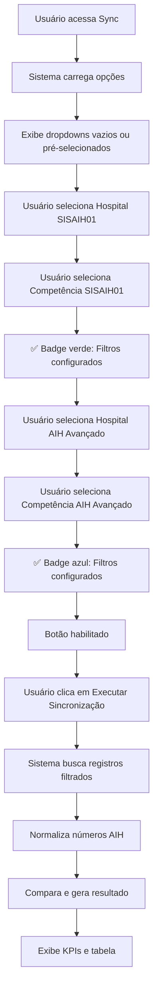

# 🔄 Atualização: Tela Sync com Seleção de Filtros

## 📋 Resumo da Atualização

A tela **Sync** foi atualizada para permitir que o usuário selecione **competência e hospital** de cada base de dados (SISAIH01 e AIH Avançado) antes de executar a sincronização. Isso oferece maior controle e flexibilidade para comparar períodos específicos.

---

## 🎯 Mudança de Comportamento

### **ANTES:**
```
✅ Tela carregava automaticamente ao abrir
✅ Buscava TODOS os registros de ambas as tabelas
✅ Usuário não tinha controle sobre o que comparar
✅ Podia ser lento com muitos dados
```

### **DEPOIS:**
```
✅ Usuário seleciona competência e hospital manualmente
✅ Busca APENAS os registros filtrados
✅ Total controle sobre o que comparar
✅ Performance otimizada (consultas menores)
✅ Possibilidade de comparar competências diferentes
```

---

## 🖥️ Nova Interface

### **Seção de Configuração da Sincronização:**

```
┌────────────────────────────────────────────────────────────────┐
│  🔄 Configuração da Sincronização                              │
│  Selecione competência e hospital para cada base de dados     │
├─────────────────────────────────┬──────────────────────────────┤
│  SISAIH01 (Confirmados SUS) ⭐  │  AIH Avançado (Processamento)│
│  ┌─────────────────────────┐    │  ┌─────────────────────────┐ │
│  │ Hospital: [Dropdown]    │    │  │ Hospital: [Dropdown]    │ │
│  │ Competência: [Dropdown] │    │  │ Competência: [Dropdown] │ │
│  │ ✅ Filtros configurados │    │  │ ✅ Filtros configurados │ │
│  └─────────────────────────┘    │  └─────────────────────────┘ │
├─────────────────────────────────┴──────────────────────────────┤
│              [🔄 Executar Sincronização]                       │
└────────────────────────────────────────────────────────────────┘
```

---

## 🔧 Funcionalidades Implementadas

### **1. Seleção de Filtros SISAIH01 (Verde)**
- ✅ **Hospital:** Dropdown com hospitais disponíveis
- ✅ **Competência:** Dropdown com competências de `aih_registros`
- ✅ **Formatação:** Competências exibidas como MM/YYYY (ex: 10/2025)
- ✅ **Indicador Visual:** Badge verde quando configurado

### **2. Seleção de Filtros AIH Avançado (Azul)**
- ✅ **Hospital:** Dropdown com hospitais disponíveis
- ✅ **Competência:** Dropdown com competências de `aihs`
- ✅ **Formatação:** Competências exibidas como MM/YYYY (ex: 10/2025)
- ✅ **Indicador Visual:** Badge azul quando configurado

### **3. Botão de Execução**
- ✅ **Desabilitado** quando falta algum filtro
- ✅ **Estado de Loading** durante processamento
- ✅ **Ícone GitCompare** e texto descritivo
- ✅ **Gradiente roxo** para destaque

### **4. Validações**
- ✅ Bloqueia execução sem hospital SISAIH01
- ✅ Bloqueia execução sem competência SISAIH01
- ✅ Bloqueia execução sem hospital AIH Avançado
- ✅ Bloqueia execução sem competência AIH Avançado
- ✅ Toast de erro descritivo para cada validação

### **5. Carregamento Automático de Opções**
- ✅ Busca competências únicas de `aih_registros`
- ✅ Busca competências únicas de `aihs`
- ✅ Busca hospitais de `hospitals`
- ✅ Pré-seleciona última competência (mais recente)
- ✅ Pré-seleciona hospital do usuário (se não for admin)

---

## 📊 Fluxo de Uso



---

## 🎨 Código de Cores

| Elemento | Cor | Classe CSS | Uso |
|----------|-----|------------|-----|
| **SISAIH01** | Verde | `green-50/300/600` | Fundo, borda, texto |
| **AIH Avançado** | Azul | `blue-50/300/600` | Fundo, borda, texto |
| **Botão Executar** | Roxo | `purple-600/indigo-600` | Gradiente |
| **Badge OK** | Verde/Azul | `green-100/blue-100` | Indicador |

---

## 📝 Consultas SQL

### **Buscar Competências SISAIH01:**
```sql
SELECT DISTINCT competencia 
FROM aih_registros 
WHERE competencia IS NOT NULL
ORDER BY competencia DESC;
```

### **Buscar Competências AIH Avançado:**
```sql
SELECT DISTINCT competencia 
FROM aihs 
WHERE competencia IS NOT NULL
ORDER BY competencia DESC;
```

### **Buscar Hospitais:**
```sql
SELECT id, name 
FROM hospitals 
ORDER BY name;
```

### **Buscar AIHs Filtradas (SISAIH01):**
```sql
SELECT * 
FROM aih_registros
WHERE hospital_id = :hospital
  AND competencia = :competencia;
```

### **Buscar AIHs Filtradas (AIH Avançado):**
```sql
SELECT * 
FROM aihs
WHERE hospital_id = :hospital
  AND competencia = :competencia;
```

---

## 🚀 Como Usar (Novo Fluxo)

### **Passo 1: Acessar a Tela**
```
1. No menu lateral, clique em "Sync"
2. A tela abre com dropdowns vazios ou pré-selecionados
```

### **Passo 2: Configurar SISAIH01 (Verde)**
```
1. Selecione o hospital (se admin)
2. Selecione a competência (ex: 10/2025)
3. Veja o badge verde: "✅ Filtros configurados"
```

### **Passo 3: Configurar AIH Avançado (Azul)**
```
1. Selecione o hospital (se admin)
2. Selecione a competência (ex: 10/2025)
3. Veja o badge azul: "✅ Filtros configurados"
```

### **Passo 4: Executar Sincronização**
```
1. Botão "Executar Sincronização" fica habilitado
2. Clique no botão
3. Aguarde o processamento
4. Veja os resultados nos KPIs e tabela
```

### **Passo 5: Analisar Resultados**
```
1. Observe os 5 KPIs no topo
2. Use filtros para ver cada status
3. Analise a tabela de comparações
```

---

## 🎯 Casos de Uso

### **Caso 1: Comparar Mesma Competência**
```typescript
// Usuário quer ver sincronia de outubro/2025
SISAIH01:        Hospital A, Competência 202510
AIH Avançado:    Hospital A, Competência 202510

Resultado:
  ✅ Sincronizados: AIHs em ambas as bases
  ⏳ Pendentes: AIHs só no AIH Avançado
  ❌ Não Processados: AIHs só no SISAIH01
```

### **Caso 2: Comparar Competências Diferentes**
```typescript
// Usuário quer ver se AIHs de setembro foram confirmadas em outubro
SISAIH01:        Hospital A, Competência 202510 (outubro)
AIH Avançado:    Hospital A, Competência 202509 (setembro)

Resultado:
  Identifica AIHs de setembro que foram confirmadas em outubro pelo SUS
```

### **Caso 3: Comparar Hospitais Diferentes (Admin)**
```typescript
// Admin quer comparar se dados de Hospital A chegaram no Hospital B
SISAIH01:        Hospital B, Competência 202510
AIH Avançado:    Hospital A, Competência 202510

Resultado:
  Identifica possíveis inconsistências entre hospitais
```

### **Caso 4: Usuário Regular (Não Admin)**
```typescript
// Usuário regular só vê seu hospital
SISAIH01:        Hospital A (fixo), Competência 202510
AIH Avançado:    Hospital A (fixo), Competência 202510

Hospital é pré-selecionado e desabilitado
Só pode escolher competência
```

---

## 📊 Exemplo de Logs

```javascript
// Ao carregar opções
📋 Carregando opções de filtros...
✅ Opções de filtros carregadas

// Ao executar sincronização
🔄 Iniciando processo de sincronização...
📅 SISAIH01 - Competência: 202510 | Hospital: abc-123-def
📅 AIH Avançado - Competência: 202510 | Hospital: abc-123-def
✅ 50 registros encontrados em AIH Avançado
✅ 45 registros encontrados em SISAIH01
🔍 Comparando 60 números AIH únicos...
📊 RESULTADO DA SINCRONIZAÇÃO:
   ✅ Sincronizados: 40
   ⏳ Pendentes Confirmação: 10
   ❌ Não Processados: 5
   📈 Taxa de Sincronização: 88.89%
```

---

## 💬 Mensagens de Validação

### **Falta Filtro SISAIH01:**
```
❌ Selecione competência e hospital do SISAIH01
```

### **Falta Filtro AIH Avançado:**
```
❌ Selecione competência e hospital do AIH Avançado
```

### **Sucesso:**
```
✅ Sincronização concluída!
40 AIHs sincronizadas | Taxa: 88.9%
```

---

## 🔐 Controle de Acesso

### **Usuários Regulares:**
- ❌ Não podem escolher hospital (fixo)
- ✅ Podem escolher competência
- ✅ Texto informativo: "Hospital fixo: seu hospital vinculado"

### **Administradores:**
- ✅ Podem escolher qualquer hospital
- ✅ Podem escolher qualquer competência
- ✅ Total flexibilidade

---

## 📁 Alterações nos Arquivos

| Arquivo | Linhas Modificadas | Descrição |
|---------|-------------------|-----------|
| `src/components/SyncPage.tsx` | ~60-150 | Novos estados para filtros |
| `src/components/SyncPage.tsx` | ~82-146 | Função `carregarOpcoesFiltros()` |
| `src/components/SyncPage.tsx` | ~148-175 | Função `executarSync()` modificada |
| `src/components/SyncPage.tsx` | ~385-525 | Nova seção de UI para filtros |

---

## 🎨 Layout Responsivo

### **Desktop (> 1024px):**
```
┌─────────────────────────────────┬─────────────────────────────────┐
│  SISAIH01 (Verde)               │  AIH Avançado (Azul)            │
│  • Hospital                     │  • Hospital                     │
│  • Competência                  │  • Competência                  │
└─────────────────────────────────┴─────────────────────────────────┘
              [Executar Sincronização]
```

### **Mobile (< 1024px):**
```
┌───────────────────────────────────────┐
│  SISAIH01 (Verde)                     │
│  • Hospital                           │
│  • Competência                        │
└───────────────────────────────────────┘

┌───────────────────────────────────────┐
│  AIH Avançado (Azul)                  │
│  • Hospital                           │
│  • Competência                        │
└───────────────────────────────────────┘

      [Executar Sincronização]
```

---

## ✅ Checklist de Implementação

| Item | Status |
|------|--------|
| ✅ Estados para filtros SISAIH01 | **COMPLETO** |
| ✅ Estados para filtros AIH Avançado | **COMPLETO** |
| ✅ Função `carregarOpcoesFiltros()` | **COMPLETO** |
| ✅ Busca de competências únicas | **COMPLETO** |
| ✅ Busca de hospitais | **COMPLETO** |
| ✅ Pré-seleção de valores | **COMPLETO** |
| ✅ Função `executarSync()` com filtros | **COMPLETO** |
| ✅ Validações de filtros obrigatórios | **COMPLETO** |
| ✅ UI com 2 seções de filtros | **COMPLETO** |
| ✅ Badges de confirmação | **COMPLETO** |
| ✅ Botão de execução com estados | **COMPLETO** |
| ✅ Logs detalhados com filtros | **COMPLETO** |
| ✅ Controle de acesso por perfil | **COMPLETO** |
| ✅ Responsividade mobile/desktop | **COMPLETO** |
| ✅ Sem erros de linting | **VERIFICADO** |

---

## 🎉 Benefícios da Atualização

### **1. Controle Total**
- ✨ Usuário escolhe exatamente o que comparar
- ✨ Pode comparar competências diferentes
- ✨ Pode analisar períodos específicos

### **2. Performance**
- ⚡ Consultas menores e mais rápidas
- ⚡ Não carrega dados desnecessários
- ⚡ Reduz carga no banco de dados

### **3. Flexibilidade**
- 🔄 Permite análises temporais
- 🔄 Compara diferentes períodos
- 🔄 Identifica atrasos na confirmação

### **4. Usabilidade**
- 🎯 Interface intuitiva com cores
- 🎯 Indicadores visuais claros
- 🎯 Validações descritivas

---

## 🚀 Status Final

**✅ ATUALIZAÇÃO COMPLETA E FUNCIONAL**

A tela Sync agora oferece total controle sobre a sincronização, permitindo que o usuário selecione competência e hospital de cada base antes de executar a comparação!

---

**Data de Atualização:** 17 de janeiro de 2025  
**Versão:** 1.1  
**Sistema:** SigtapSync-9

