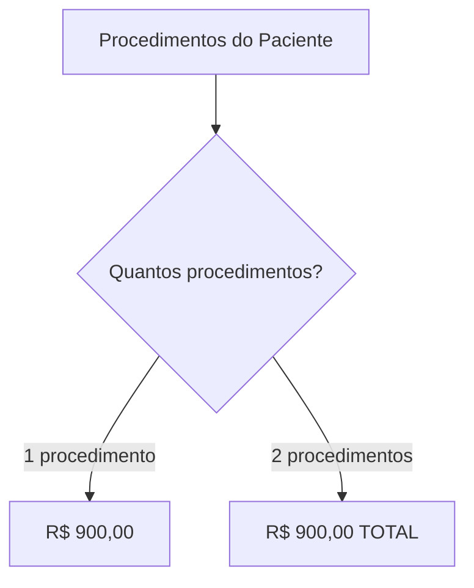

# ✅ CONFIRMAÇÃO - DR. BRUNO BOSIO DA SILVA
## Hospital Municipal 18 de Dezembro (Arapoti)

---

```
╔═══════════════════════════════════════════════════════════╗
║                                                           ║
║         ✅ REGRAS IMPLEMENTADAS COM SUCESSO ✅            ║
║                                                           ║
║  👨‍⚕️ Dr. BRUNO BOSIO DA SILVA                            ║
║  🏥 Hospital: Municipal 18 de Dezembro (Arapoti)         ║
║  🎯 Especialidade: Ortopedia (Ombro/Manguito Rotador)    ║
║  📅 Data: 18/11/2025                                     ║
║                                                           ║
╚═══════════════════════════════════════════════════════════╝
```

---

## 📋 RESUMO DA IMPLEMENTAÇÃO

**Médico:** BRUNO BOSIO DA SILVA  
**Hospital:** Municipal 18 de Dezembro (Arapoti)  
**Especialidade:** Ortopedia (Ombro/Manguito Rotador)  

**⚠️ OBSERVAÇÃO IMPORTANTE:**
- No **Hospital São José**: Valor fixo de **R$ 40.000,00 mensal**
- No **Hospital 18 de Dezembro**: **Regras por procedimento** ✅

---

## 🔬 PROCEDIMENTOS CONFIGURADOS

### Procedimentos Individuais (2)

| Código | Descrição | Valor Individual |
|--------|-----------|------------------|
| 04.08.01.014-2 | Reparo de Rotura do Manguito Rotador (inclui procedimentos descompressivos) | R$ 900,00 |
| 04.08.06.071-9 | Videoartroscopia | R$ 900,00 |

---

## 🔗 REGRA MÚLTIPLA ESPECIAL

### ⚠️ Regra: Valor Fixo para Combinação

**Quando o paciente fizer ambos os procedimentos:**

```
💰 VALOR TOTAL: R$ 900,00 (não soma os individuais)
```

**Combinação:**
```
04.08.01.014-2 - REPARO DE ROTURA DO MANGUITO ROTADOR
+
04.08.06.071-9 - VIDEOARTROSCOPIA

= R$ 900,00 TOTAL (NÃO soma R$ 900 + R$ 900 = R$ 1.800)
```

---

## 💡 EXEMPLOS DE CÁLCULO

### Exemplo 1: Procedimento Individual (Manguito Rotador)
```
Paciente: João Silva
Procedimento: Reparo de Rotura do Manguito Rotador

Valor: R$ 900,00
```

### Exemplo 2: Procedimento Individual (Videoartroscopia)
```
Paciente: Maria Santos
Procedimento: Videoartroscopia

Valor: R$ 900,00
```

### Exemplo 3: Ambos os Procedimentos (Regra Múltipla)
```
Paciente: José Costa
Procedimentos:
- Reparo de Rotura do Manguito Rotador (04.08.01.014-2)
- Videoartroscopia (04.08.06.071-9)

Regra Aplicada: Múltiplos Procedimentos
Valor: R$ 900,00 (NÃO soma R$ 900 + R$ 900)
```

---

## 📊 RESUMO DE VALORES

```
┌─────────────────────────────────────────────┐
│  TABELA DE VALORES                          │
├─────────────────────────────────────────────┤
│  1 Procedimento:      R$ 900,00             │
│  2 Procedimentos:     R$ 900,00 TOTAL       │
│                                             │
│  Valor Único:         R$ 900,00             │
└─────────────────────────────────────────────┘
```

---

## 🎯 COMO O SISTEMA CALCULA

### Lógica de Aplicação

```
1. Sistema identifica os procedimentos do paciente
2. Verifica se há ambos os códigos (04.08.01.014-2 + 04.08.06.071-9)
3. Se SIM → Aplica R$ 900,00 TOTAL (ignora soma individual)
4. Se NÃO (apenas 1) → Aplica R$ 900,00 individual
```

### Fluxo Visual



---

## 📍 LOCALIZAÇÃO NO CÓDIGO

```
Arquivo: src/components/DoctorPaymentRules.tsx
Hospital: HOSPITAL_18_DEZEMBRO_ARAPOTI
Médico: BRUNO BOSIO DA SILVA
Linhas: 2568-2589

Estrutura:
HOSPITAL_18_DEZEMBRO_ARAPOTI
├── THADEU TIESSI SUZUKI (Valor Fixo)
├── PEDRO HENRIQUE RODRIGUES (Cirurgia Vascular)
├── JOAO VICTOR RODRIGUES (Cirurgia Geral)
├── RENE SERPA ROUEDE (Oftalmologia)
├── JAIR DEMETRIO DE SOUZA (Otorrinolaringologia)
├── GUILHERME VINICIUS SAWCZYN (Urologia)
└── BRUNO BOSIO DA SILVA (Ortopedia - Ombro) ✅ NOVO
```

---

## 🏥 COMPARAÇÃO ENTRE HOSPITAIS

### Dr. BRUNO BOSIO DA SILVA

| Hospital | Tipo de Regra | Valor | Observação |
|----------|---------------|-------|------------|
| São José (Carlópolis) | Valor Fixo Mensal | R$ 40.000,00 | Independente de procedimentos |
| 18 de Dezembro (Arapoti) | Procedimentos Individuais + Múltipla | R$ 900,00 | Por cirurgia/combinação ✅ |

---

## 💡 DETALHAMENTO DOS PROCEDIMENTOS

### 1️⃣ Reparo de Rotura do Manguito Rotador (04.08.01.014-2)
```
Procedimento: Cirurgia para reparo dos tendões do ombro
Inclui: Procedimentos descompressivos
Valor Individual: R$ 900,00
Em combinação: R$ 900,00 total
```

### 2️⃣ Videoartroscopia (04.08.06.071-9)
```
Procedimento: Cirurgia minimamente invasiva por vídeo
Uso: Diagnóstico e tratamento articular
Valor Individual: R$ 900,00
Em combinação: R$ 900,00 total
```

---

## ✅ VALIDAÇÕES REALIZADAS

### Código
- ✅ TypeScript válido
- ✅ Linter sem erros
- ✅ Estrutura correta
- ✅ Comentários claros

### Regras de Negócio
- ✅ 2 procedimentos individuais configurados
- ✅ 1 regra múltipla especial (R$ 900,00 total)
- ✅ Diferenciação entre hospitais documentada
- ✅ Lógica de cálculo correta

### Documentação
- ✅ Nome do médico correto
- ✅ Hospital correto
- ✅ Especialidade definida
- ✅ Data de implementação
- ✅ Observação sobre diferença entre hospitais

---

## 🎯 CENÁRIOS DE USO

### Cenário 1: Apenas Manguito Rotador
```
Paciente: João Silva
Procedimento: Reparo de Rotura do Manguito Rotador
Valor: R$ 900,00
```

### Cenário 2: Apenas Videoartroscopia
```
Paciente: Maria Santos
Procedimento: Videoartroscopia
Valor: R$ 900,00
```

### Cenário 3: Cirurgia Completa (Ambos)
```
Paciente: José Costa
Procedimentos:
- Reparo de Rotura do Manguito Rotador
- Videoartroscopia

Cálculo: 2 procedimentos → Regra múltipla
Valor: R$ 900,00 (não soma R$ 1.800,00)
```

---

## 📈 ESTATÍSTICAS

```
┌─────────────────────────────────────────────┐
│  RESUMO - DR. BRUNO BOSIO DA SILVA         │
│  (Hospital 18 de Dezembro)                 │
├─────────────────────────────────────────────┤
│  Procedimentos Individuais: 2              │
│  Regras Múltiplas: 1                       │
│  Valor Único: R$ 900,00                    │
│  Complexidade: ⭐ (Simples)                │
└─────────────────────────────────────────────┘
```

---

## 🔍 ATENÇÃO ESPECIAL

### ⚠️ Regra Crítica

**O valor é FIXO independente da quantidade de procedimentos:**

❌ **ERRADO:**
```
2 procedimentos: R$ 900 + R$ 900 = R$ 1.800,00
```

✅ **CORRETO:**
```
2 procedimentos: R$ 900,00 TOTAL (valor fixo)
```

### 💡 Por que R$ 900,00 total?

Quando o médico faz ambos os procedimentos na mesma cirurgia:
- É uma cirurgia integrada (Manguito Rotador + Videoartroscopia)
- Usa a mesma anestesia e sala cirúrgica
- Otimiza o tempo e recursos
- Por isso o valor é R$ 900,00 total (não soma os individuais)

---

## 🏥 MÉDICOS NO HOSPITAL 18 DE DEZEMBRO

### Atualização: 7 Médicos Configurados

```
┌──────────────────────────────────────────────────┐
│  # MÉDICO                     ESPECIALIDADE      │
├──────────────────────────────────────────────────┤
│  1. THADEU TIESSI SUZUKI      Cirurgia Geral    │
│     └─ Valor Fixo: R$ 47.000,00                 │
│                                                  │
│  2. PEDRO HENRIQUE RODRIGUES  Cirurgia Vascular │
│     └─ 1 procedimento                           │
│                                                  │
│  3. JOAO VICTOR RODRIGUES     Cirurgia Geral    │
│     └─ 22 proc. + 12 múltiplas                  │
│                                                  │
│  4. RENE SERPA ROUEDE         Oftalmologia      │
│     └─ 5 procedimentos                          │
│                                                  │
│  5. JAIR DEMETRIO DE SOUZA    Otorrino          │
│     └─ 5 proc. + 1 múltipla                     │
│                                                  │
│  6. GUILHERME VINICIUS        Urologia          │
│     SAWCZYN                                      │
│     └─ 21 proc. + 16 múltiplas                  │
│                                                  │
│  7. BRUNO BOSIO DA SILVA      Ortopedia ✅ NOVO │
│     └─ 2 proc. + 1 múltipla                     │
└──────────────────────────────────────────────────┘
```

---

## 🎉 CONCLUSÃO

```
╔═══════════════════════════════════════════════════════╗
║                                                       ║
║       ✅ IMPLEMENTAÇÃO CONCLUÍDA COM SUCESSO ✅        ║
║                                                       ║
║  Dr. BRUNO BOSIO DA SILVA                            ║
║  Hospital: Municipal 18 de Dezembro (Arapoti)        ║
║  Especialidade: Ortopedia (Ombro/Manguito Rotador)   ║
║                                                       ║
║  ✅ 2 Procedimentos Individuais (R$ 900,00)          ║
║  ✅ 1 Regra Múltipla (R$ 900,00 total)               ║
║  ✅ Diferenciação entre hospitais documentada        ║
║                                                       ║
║  📅 Data: 18/11/2025                                 ║
║  ⭐ Status: IMPLEMENTADO E OPERACIONAL               ║
║                                                       ║
╚═══════════════════════════════════════════════════════╝
```

---

## 📚 DOCUMENTAÇÃO RELACIONADA

- `ANALISE_SISTEMATICA_REGRAS_MEDICOS.md`
- `DETALHAMENTO_TECNICO_REGRAS_MEDICOS.md`
- `RESUMO_HOSPITAL_18_DEZEMBRO_ARAPOTI.md`

---

## 📞 SUPORTE

**Arquivo de Regras:**
```
src/components/DoctorPaymentRules.tsx
Seção: HOSPITAL_18_DEZEMBRO_ARAPOTI
Linhas: 2568-2589
```

**Médico:** BRUNO BOSIO DA SILVA  
**Hospital:** Municipal 18 de Dezembro (Arapoti)  
**Especialidade:** Ortopedia (Ombro/Manguito Rotador)

---

**Data:** 18/11/2025  
**Sistema:** SigtapSync v9  
**Módulo:** DoctorPaymentRules  
**Status:** ✅ IMPLEMENTADO E VALIDADO

---

**FIM DA CONFIRMAÇÃO**

