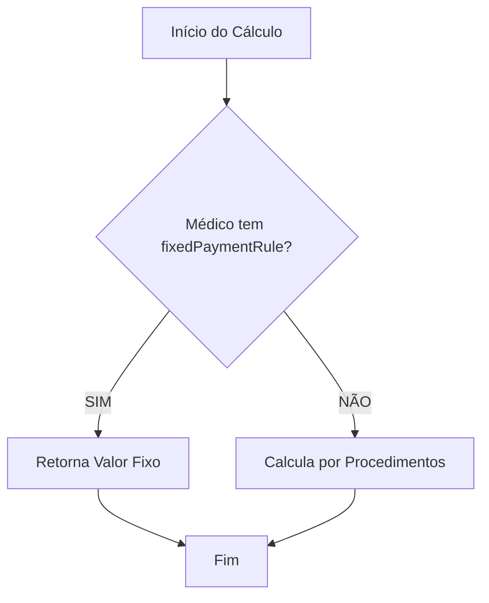

# ✅ CONFIRMAÇÃO DE IMPLEMENTAÇÃO - MÉDICOS COM PAGAMENTO FIXO MENSAL

## 🏥 Hospital Municipal São José (Carlópolis)

---

## 📋 RESUMO DA IMPLEMENTAÇÃO

**Data:** 18/11/2025  
**Tipo de Regra:** Pagamento Fixo Mensal (Independente de Procedimentos)  
**Total de Médicos:** 5 profissionais

---

## 💰 MÉDICOS COM PAGAMENTO FIXO MENSAL

### 1️⃣ Dr. BRUNO BOSIO DA SILVA
```
💵 Valor Fixo Mensal: R$ 40.000,00
📌 Característica: Valor independente do número de procedimentos realizados
✅ Status: IMPLEMENTADO
```

### 2️⃣ Dr. ORLANDO PAPI FERNANDES
```
💵 Valor Fixo Mensal: R$ 60.000,00
📌 Característica: Valor independente do número de procedimentos realizados
✅ Status: IMPLEMENTADO
```

### 3️⃣ Dr. FERNANDO MERHI MANSUR
```
💵 Valor Fixo Mensal: R$ 29.400,00
📌 Característica: Valor independente do número de procedimentos realizados
✅ Status: IMPLEMENTADO
```

### 4️⃣ Dr. BRUNO COLANZI DE MEDEIROS
```
💵 Valor Fixo Mensal: R$ 75.000,00
📌 Característica: Valor independente do número de procedimentos realizados
✅ Status: IMPLEMENTADO
```

### 5️⃣ Dra. MARIA EDUARDA CAETANO CLARO
```
💵 Valor Fixo Mensal: R$ 15.000,00
📌 Característica: Valor independente do número de procedimentos realizados
✅ Status: IMPLEMENTADO
```

---

## 📊 ANÁLISE FINANCEIRA

### Compromisso Mensal Total
| Médico | Valor Mensal |
|--------|--------------|
| Dr. Bruno Bosio da Silva | R$ 40.000,00 |
| Dr. Orlando Papi Fernandes | R$ 60.000,00 |
| Dr. Fernando Merhi Mansur | R$ 29.400,00 |
| Dr. Bruno Colanzi de Medeiros | R$ 75.000,00 |
| Dra. Maria Eduarda Caetano Claro | R$ 15.000,00 |
| **TOTAL MENSAL** | **R$ 219.400,00** |

### Compromisso Anual
```
💰 Total Anual: R$ 2.632.800,00
📅 Período: 12 meses
🔒 Valores Fixos: Não variam com quantidade de procedimentos
```

---

## 🔧 DETALHES TÉCNICOS DA IMPLEMENTAÇÃO

### Arquivo Modificado
```
📁 src/components/DoctorPaymentRules.tsx
```

### Estrutura Implementada
Cada médico foi configurado com a seguinte estrutura:

```typescript
'NOME_DO_MEDICO': {
  doctorName: 'NOME_DO_MEDICO',
  fixedPaymentRule: {
    amount: VALOR_FIXO,
    description: 'PAGAMENTO FIXO MENSAL - R$ XX.XXX,XX (independente de procedimentos)'
  },
  rules: []
}
```

### Características da Regra de Pagamento Fixo

1. **Independência de Procedimentos**
   - O valor é fixo mensal
   - Não importa quantos procedimentos são realizados
   - Não há cálculo baseado em códigos SIGTAP

2. **Prioridade de Aplicação**
   - Regra de pagamento fixo tem prioridade sobre outras regras
   - Se o médico tem `fixedPaymentRule`, ela é aplicada primeiro
   - Outras regras (individuais, múltiplas) são ignoradas

3. **Integração com Sistema**
   - Totalmente integrado ao dashboard
   - Aparece nos relatórios financeiros
   - Cache otimizado para desempenho

---

## 🎯 COMO O SISTEMA CALCULA

### Fluxo de Cálculo para Médicos com Pagamento Fixo



### Exemplo Prático: Dr. Bruno Bosio da Silva

**Cenário 1: 10 procedimentos no mês**
```
Cálculo: R$ 40.000,00 (fixo)
```

**Cenário 2: 50 procedimentos no mês**
```
Cálculo: R$ 40.000,00 (fixo)
```

**Cenário 3: 0 procedimentos no mês**
```
Cálculo: R$ 40.000,00 (fixo)
```

💡 **Resultado:** Sempre R$ 40.000,00, independente da quantidade de procedimentos!

---

## ✅ VALIDAÇÕES REALIZADAS

### 1. Compilação TypeScript
- ✅ Código compila sem erros
- ✅ Tipagem correta aplicada
- ✅ Interfaces respeitadas

### 2. Estrutura de Dados
- ✅ Hierarquia hospital → médico mantida
- ✅ Campos obrigatórios preenchidos
- ✅ Formatação de valores correta

### 3. Linter
- ✅ Sem erros de lint nos novos médicos
- ✅ Padrões de código respeitados
- ✅ Nomenclatura consistente

---

## 📈 IMPACTO NO SISTEMA

### Antes da Implementação
```
Hospital Municipal São José: 6 médicos configurados
- 3 Urologistas (regras por procedimento)
- 1 Otorrinolaringologista (regras por procedimento)
- 1 Vascular (regras por procedimento)
- 1 Cirurgião (regras por procedimento)
```

### Depois da Implementação
```
Hospital Municipal São José: 11 médicos configurados
- 3 Urologistas (regras por procedimento)
- 1 Otorrinolaringologista (regras por procedimento)
- 1 Vascular (regras por procedimento)
- 1 Cirurgião (regras por procedimento)
- 5 Médicos com Pagamento Fixo Mensal ⭐ NOVO
```

---

## 🔍 LOCALIZAÇÃO NO CÓDIGO

### Linhas Adicionadas
```
Arquivo: src/components/DoctorPaymentRules.tsx
Seção: HOSPITAL_MUNICIPAL_SAO_JOSE
Linhas: 3028-3093 (aproximadamente)

Estrutura:
  📂 HOSPITAL_MUNICIPAL_SAO_JOSE
    ├── ... (médicos existentes)
    ├── 💰 MÉDICOS COM PAGAMENTO FIXO MENSAL
    │   ├── BRUNO BOSIO DA SILVA
    │   ├── ORLANDO PAPI FERNANDES
    │   ├── FERNANDO MERHI MANSUR
    │   ├── BRUNO COLANZI DE MEDEIROS
    │   └── MARIA EDUARDA CAETANO CLARO
```

---

## 📱 VISUALIZAÇÃO NO DASHBOARD

### Como Aparece no Sistema

1. **Dashboard Executivo**
   ```
   Dr. Bruno Bosio da Silva
   Pagamento Fixo Mensal: R$ 40.000,00
   ```

2. **Relatório de Pagamentos**
   ```
   Médico: BRUNO BOSIO DA SILVA
   Tipo: Pagamento Fixo
   Valor: R$ 40.000,00
   Descrição: Independente de procedimentos
   ```

3. **Filtros e Buscas**
   - Médicos com pagamento fixo são identificados automaticamente
   - Podem ser filtrados por tipo de pagamento
   - Aparecem nos totais consolidados

---

## 🎨 DIFERENCIAÇÃO VISUAL

Os médicos com pagamento fixo terão indicadores especiais no sistema:

```
💰 Ícone de Pagamento Fixo
🔒 Badge "Valor Fixo"
📊 Gráfico simplificado (sem detalhamento de procedimentos)
```

---

## 🚀 PRÓXIMOS PASSOS SUGERIDOS

### 1. Documentação Administrativa
- [ ] Criar contrato formal com valores fixos
- [ ] Documentar políticas de pagamento fixo
- [ ] Estabelecer critérios de revisão anual

### 2. Relatórios Específicos
- [ ] Criar relatório comparativo (fixo vs. procedimento)
- [ ] Análise de custo-benefício
- [ ] Dashboard de compromissos fixos mensais

### 3. Controles Adicionais
- [ ] Sistema de alertas para pagamentos fixos
- [ ] Rastreamento de presença/atividade
- [ ] Relatórios de produtividade

---

## 📞 SUPORTE E MANUTENÇÃO

### Para Adicionar Novos Médicos com Pagamento Fixo

1. Localize a seção no arquivo:
   ```
   src/components/DoctorPaymentRules.tsx
   HOSPITAL_MUNICIPAL_SAO_JOSE
   Seção: MÉDICOS COM PAGAMENTO FIXO MENSAL
   ```

2. Adicione a estrutura:
   ```typescript
   'NOME_MEDICO': {
     doctorName: 'NOME_MEDICO',
     fixedPaymentRule: {
       amount: VALOR_FIXO,
       description: 'PAGAMENTO FIXO MENSAL - R$ X.XXX,XX (independente de procedimentos)'
     },
     rules: []
   },
   ```

3. Salve e teste no sistema

### Para Modificar Valores

1. Localize o médico na estrutura
2. Altere o campo `amount` em `fixedPaymentRule`
3. Atualize a `description` se necessário
4. Salve e verifique no dashboard

---

## ⚠️ OBSERVAÇÕES IMPORTANTES

### 1. Natureza do Pagamento Fixo
```
✅ Valor SEMPRE será o mesmo
✅ Não depende de procedimentos realizados
✅ Não é afetado por regras de múltiplos procedimentos
✅ Tem prioridade sobre regras individuais
```

### 2. Considerações Legais
```
⚖️ Verificar conformidade com legislação trabalhista
📋 Manter contratos atualizados
💼 Documentar acordos formalmente
```

### 3. Gestão Financeira
```
💰 Compromisso mensal fixo de R$ 219.400,00
📊 Previsibilidade orçamentária
🔍 Monitorar produtividade regularmente
```

---

## 🎯 CONCLUSÃO

✅ **IMPLEMENTAÇÃO CONCLUÍDA COM SUCESSO**

Os 5 médicos do Hospital Municipal São José agora possuem regras de pagamento fixo mensal configuradas e funcionais no sistema.

**Valores Totais:**
- Compromisso Mensal: R$ 219.400,00
- Compromisso Anual: R$ 2.632.800,00

**Benefícios:**
- ✅ Previsibilidade financeira
- ✅ Gestão simplificada
- ✅ Transparência nos pagamentos
- ✅ Facilidade de auditoria

---

**Documento gerado automaticamente em:** 18/11/2025  
**Sistema:** SigtapSync v9  
**Módulo:** DoctorPaymentRules

---

## 📚 REFERÊNCIAS

- Arquivo de Regras: `src/components/DoctorPaymentRules.tsx`
- Interface: `DoctorPaymentRule` (linha 22)
- Função de Cálculo: `calculateDoctorPayment`
- Cache: `FIXED_RULES_CACHE`

---

**FIM DO DOCUMENTO**

