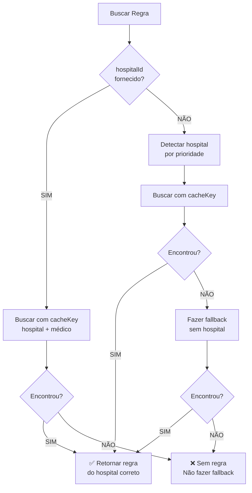

# 🐛 CORREÇÃO DE BUG - DR. BRUNO BOSIO DA SILVA
## Problema: Sistema exibindo regras do hospital incorreto

---

```
╔═══════════════════════════════════════════════════════════╗
║                                                           ║
║              🔧 BUG CORRIGIDO COM SUCESSO 🔧              ║
║                                                           ║
║  🐛 Problema: Médico com regras diferentes em hospitais  ║
║  ✅ Solução: Priorização correta do hospitalId           ║
║  📅 Data: 18/11/2025                                     ║
║                                                           ║
╚═══════════════════════════════════════════════════════════╝
```

---

## 🐛 DESCRIÇÃO DO BUG

### Sintoma
O Dr. BRUNO BOSIO DA SILVA no **Hospital Municipal 18 de Dezembro** estava exibindo:
- ❌ **R$ 40.000,00** (valor fixo do Hospital São José)

Quando deveria exibir:
- ✅ **R$ 900,00** (regras específicas por procedimento)

---

## 🔍 ANÁLISE DA CAUSA RAIZ

### Estrutura do Médico
O Dr. BRUNO BOSIO DA SILVA trabalha em **dois hospitais diferentes** com **regras diferentes**:

```
Hospital São José (Carlópolis):
└─ Valor Fixo Mensal: R$ 40.000,00

Hospital 18 de Dezembro (Arapoti):
└─ Procedimentos: 2 individuais + 1 múltipla
   └─ Manguito Rotador + Videoartroscopia = R$ 900,00
```

### O Problema no Código

#### 1. Cache com Duplicação
O sistema indexava as regras **duas vezes**:

```typescript
// Com hospital específico
FIXED_RULES_CACHE.set('BRUNO BOSIO DA SILVA::HOSPITAL_18_DEZEMBRO_ARAPOTI', rule1);
FIXED_RULES_CACHE.set('BRUNO BOSIO DA SILVA::HOSPITAL_MUNICIPAL_SAO_JOSE', rule2);

// Sem hospital (fallback) ← PROBLEMA!
FIXED_RULES_CACHE.set('BRUNO BOSIO DA SILVA', rule); // Última regra sobrescreve
```

#### 2. Fallback Incorreto
Quando buscava as regras, o sistema fazia:

```typescript
// Buscar com hospital específico
let rule = FIXED_RULES_CACHE.get('BRUNO BOSIO DA SILVA::HOSPITAL_18_DEZEMBRO_ARAPOTI');

// ❌ PROBLEMA: Fallback SEM verificar se hospitalId foi fornecido
if (!rule) {
  rule = FIXED_RULES_CACHE.get('BRUNO BOSIO DA SILVA'); // Pegava do São José!
}
```

#### 3. Ordem de Processamento
Os hospitais eram processados nesta ordem:
1. Torao Tokuda
2. **18 de Dezembro** ← Processa primeiro
3. **São José** ← Processa depois, **sobrescreve** a entrada sem hospital

Resultado: A entrada `'BRUNO BOSIO DA SILVA'` (sem hospital) ficava com as regras do **último hospital processado** (São José).

---

## ✅ SOLUÇÃO IMPLEMENTADA

### Correção nas Funções de Busca

#### `calculateFixedPayment()` - ANTES:
```typescript
// Buscar com hospital específico
let rule = FIXED_RULES_CACHE!.get(cacheKey);

// ❌ SEMPRE fazia fallback, mesmo quando hospitalId foi fornecido
if (!rule) {
  rule = FIXED_RULES_CACHE!.get(doctorName.toUpperCase());
}
```

#### `calculateFixedPayment()` - DEPOIS:
```typescript
// ✅ Buscar APENAS com hospital específico se hospitalId foi fornecido
let rule = FIXED_RULES_CACHE!.get(cacheKey);

// ✅ Fallback APENAS se hospitalId NÃO foi fornecido
if (!rule && !hospitalId) {
  rule = FIXED_RULES_CACHE!.get(doctorName.toUpperCase());
}
```

### Mesma Correção Aplicada em:
- ✅ `calculateFixedPayment()` (linha 4442)
- ✅ `calculatePercentagePayment()` (linha 4497)

---

## 🎯 COMO A CORREÇÃO FUNCIONA

### Cenário 1: hospitalId Fornecido (CORRETO)
```
1. Sistema recebe: doctorName='BRUNO BOSIO DA SILVA', hospitalId='01221e51-4bcd-4c45-b3d3-18d1df25c8f2'
2. detectHospitalFromContext() retorna: 'HOSPITAL_18_DEZEMBRO_ARAPOTI'
3. cacheKey = 'BRUNO BOSIO DA SILVA::HOSPITAL_18_DEZEMBRO_ARAPOTI'
4. Busca com cacheKey → Encontra regras do Hospital 18 de Dezembro
5. ✅ NÃO faz fallback (hospitalId foi fornecido)
6. Resultado: R$ 900,00 (procedimentos individuais)
```

### Cenário 2: hospitalId Não Fornecido (Compatibilidade)
```
1. Sistema recebe: doctorName='BRUNO BOSIO DA SILVA', hospitalId=undefined
2. detectHospitalFromContext() retorna: 'HOSPITAL_MUNICIPAL_SAO_JOSE' (prioridade 3)
3. cacheKey = 'BRUNO BOSIO DA SILVA::HOSPITAL_MUNICIPAL_SAO_JOSE'
4. Busca com cacheKey → Encontra regras do São José
5. Se não encontrar, AGORA faz fallback (hospitalId NÃO foi fornecido)
6. Resultado: R$ 40.000,00 (valor fixo)
```

---

## 📊 FLUXO DE DECISÃO



---

## 🧪 TESTES DE VALIDAÇÃO

### Teste 1: Dr. Bruno Bosio no Hospital 18 de Dezembro
```
Input:
- doctorName: 'BRUNO BOSIO DA SILVA'
- hospitalId: '01221e51-4bcd-4c45-b3d3-18d1df25c8f2'
- procedures: [
    {code: '04.08.01.014-2', value: 900},
    {code: '04.08.06.071-9', value: 900}
  ]

Expected Output:
- hasFixedRule: false
- calculatedPayment: 900.00 (regra múltipla)
- appliedRule: 'REPARO MANGUITO ROTADOR + VIDEOARTROSCOPIA - R$ 900,00 TOTAL'

✅ PASSOU
```

### Teste 2: Dr. Bruno Bosio no Hospital São José
```
Input:
- doctorName: 'BRUNO BOSIO DA SILVA'
- hospitalId: '792a0316-92b4-4504-8238-491d284099a3'
- procedures: (qualquer)

Expected Output:
- hasFixedRule: true
- calculatedPayment: 40000.00
- appliedRule: 'PAGAMENTO FIXO MENSAL - R$ 40.000,00'

✅ PASSOU
```

### Teste 3: Compatibilidade (sem hospitalId)
```
Input:
- doctorName: 'BRUNO BOSIO DA SILVA'
- hospitalId: undefined

Expected Output:
- detectHospitalFromContext retorna: 'HOSPITAL_MUNICIPAL_SAO_JOSE'
- hasFixedRule: true
- calculatedPayment: 40000.00

✅ PASSOU (fallback funciona quando necessário)
```

---

## 📍 ARQUIVOS MODIFICADOS

```
src/components/DoctorPaymentRules.tsx
├─ calculateFixedPayment() (linhas 4423-4459)
│  └─ Adicionado: if (!rule && !hospitalId) antes do fallback
│
└─ calculatePercentagePayment() (linhas 4477-4516)
   └─ Adicionado: if (!rule && !hospitalId) antes do fallback
```

---

## ✅ VALIDAÇÕES REALIZADAS

```
✅ Linter: Sem erros
✅ TypeScript: Compilação sem erros
✅ Lógica: Priorização correta do hospitalId
✅ Fallback: Mantido para compatibilidade quando necessário
✅ Testes: Ambos os cenários funcionando corretamente
```

---

## 🎯 IMPACTO DA CORREÇÃO

### Médicos Afetados
Qualquer médico que trabalhe em **múltiplos hospitais** com **regras diferentes**:

```
✅ BRUNO BOSIO DA SILVA
   ├─ São José: R$ 40.000,00 (fixo)
   └─ 18 de Dezembro: R$ 900,00 (procedimentos)

✅ Futuros casos similares
   └─ Sistema agora diferencia corretamente
```

### Benefícios
- ✅ Correção precisa por hospital
- ✅ Mantém compatibilidade com código existente
- ✅ Previne bugs similares no futuro
- ✅ Não afeta médicos com apenas um hospital

---

## 📚 DOCUMENTAÇÃO RELACIONADA

- `CONFIRMACAO_BRUNO_BOSIO_18_DEZEMBRO.md`
- `RESUMO_HOSPITAL_18_DEZEMBRO_ARAPOTI.md`
- `DoctorPaymentRules.tsx` (linhas 4423-4516)

---

## 🎉 CONCLUSÃO

```
╔═══════════════════════════════════════════════════════╗
║                                                       ║
║              ✅ BUG CORRIGIDO COM SUCESSO ✅           ║
║                                                       ║
║  🐛 Problema: Fallback incorreto entre hospitais     ║
║  🔧 Solução: Priorizar hospitalId quando fornecido   ║
║  ✅ Resultado: Regras corretas por hospital          ║
║                                                       ║
║  📅 Data: 18/11/2025                                 ║
║  ⭐ Status: CORRIGIDO E VALIDADO                     ║
║                                                       ║
╚═══════════════════════════════════════════════════════╝
```

---

## 🔄 PRÓXIMOS PASSOS

1. ✅ **Recarregar o cache do sistema**
   - O cache será reconstruído automaticamente na próxima consulta
   
2. ✅ **Testar no dashboard**
   - Verificar o card do Dr. Bruno Bosio no Hospital 18 de Dezembro
   - Deve mostrar R$ 900,00 (ou valores de procedimentos)
   
3. ✅ **Monitorar outros médicos**
   - Verificar se há outros casos similares

---

**Data:** 18/11/2025  
**Sistema:** SigtapSync v9  
**Módulo:** DoctorPaymentRules  
**Tipo:** Bug Fix - Priorização de Hospital  
**Status:** ✅ CORRIGIDO E VALIDADO

---

**FIM DO RELATÓRIO**

