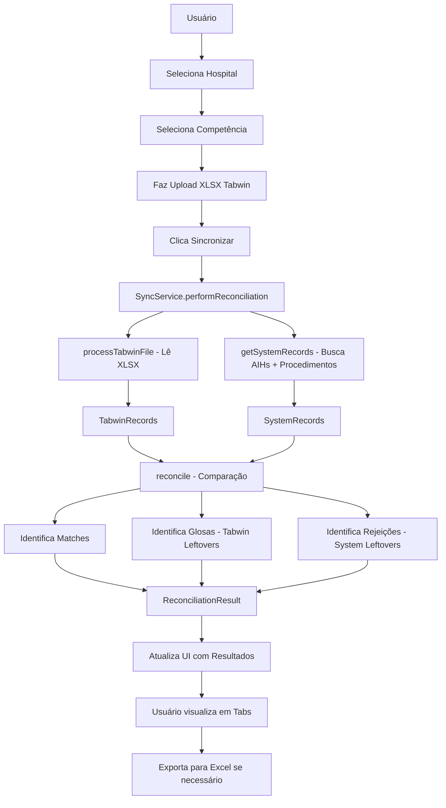

# 🔄 Tela Sync - Reconciliação Tabwin vs Sistema

## 📋 **VISÃO GERAL**

A tela **Sync** foi criada para realizar a reconciliação entre os dados do relatório XLSX do Tabwin (fonte de dados do GSUS) e os dados armazenados no sistema SigtapSync. Esta funcionalidade é essencial para identificar:

- ✅ **Matches**: Registros que batem entre Tabwin e sistema
- ❌ **Glosas**: Registros no Tabwin que não estão no sistema (possíveis glosas ou rejeições)
- ⚠️ **Rejeições**: Registros no sistema que não estão no Tabwin (possíveis pendências de faturamento)
- 💰 **Divergências de Valor**: Registros com diferenças de valores
- 🔢 **Divergências de Quantidade**: Registros com diferenças de quantidade

---

## 🏗️ **ARQUITETURA DA SOLUÇÃO**

### **1. Serviço de Reconciliação**

**Arquivo**: `src/services/syncService.ts`

#### **Classes e Métodos:**

```typescript
export class SyncService {
  // Processar arquivo XLSX do Tabwin
  static async processTabwinFile(file: File): Promise<{...}>
  
  // Buscar dados do sistema para reconciliação
  static async getSystemRecords(hospitalId: string, competencia: string): Promise<{...}>
  
  // Realizar reconciliação entre Tabwin e Sistema
  static async reconcile(tabwinRecords, systemRecords): Promise<ReconciliationResult>
  
  // Executar processo completo de reconciliação
  static async performReconciliation(file: File, hospitalId: string, competencia: string): Promise<ReconciliationResult>
}
```

#### **Interfaces Principais:**

```typescript
// Dados do Tabwin (GSUS)
interface TabwinRecord {
  sp_naih: string;           // Número da AIH
  sp_dtinter: string;        // Data de Internação
  sp_dtsaida: string;        // Data de Saída
  sp_atoprof: string;        // Código do Procedimento
  sp_qtd_ato: number;        // Quantidade do Ato
  sp_valato: number;         // Valor do Ato
  sp_pf_doc?: string;        // Documento do Profissional
}

// Dados do Sistema
interface SystemRecord {
  aih_id: string;
  aih_number: string;
  admission_date: string;
  discharge_date: string;
  procedure_code: string;
  procedure_name: string;
  procedure_date: string;
  quantity: number;
  total_value: number;       // Em centavos
  professional_document?: string;
  patient_name: string;
  hospital_id: string;
}

// Resultado da Reconciliação
interface ReconciliationResult {
  success: boolean;
  total_tabwin_records: number;
  total_system_records: number;
  matches: ReconciliationMatch[];
  tabwin_leftovers: ReconciliationLeftover[];  // Sobras no Tabwin
  system_leftovers: ReconciliationLeftover[];  // Sobras no Sistema
  summary: {
    perfect_matches: number;
    value_differences: number;
    quantity_differences: number;
    glosas_possiveis: number;
    rejeicoes_possiveis: number;
  };
  processing_time: number;
  error?: string;
}
```

---

### **2. Componente da Interface**

**Arquivo**: `src/components/SyncDashboard.tsx`

#### **Funcionalidades:**

1. **Seleção de Hospital e Competência**
   - Dropdown para selecionar o hospital
   - Dropdown para selecionar a competência (mês de referência)
   - Carrega competências disponíveis automaticamente do banco

2. **Upload de Arquivo XLSX**
   - Input de arquivo com validação de extensão (.xlsx, .xls)
   - Preview do nome do arquivo selecionado
   - Botão para remover arquivo

3. **Processamento e Reconciliação**
   - Botão "Sincronizar e Comparar"
   - Loading state durante processamento
   - Toast notifications para feedback

4. **Visualização de Resultados**
   - **Cards de Resumo**: 5 cards com estatísticas principais
   - **Tabs de Detalhamento**: 3 tabs para visualizar diferentes aspectos

#### **Tabs de Resultados:**

##### **Tab 1: Matches**
- Lista todos os registros que tiveram correspondência
- Mostra status: OK, Diferença de Valor, Diferença de Quantidade
- Exibe AIH, Procedimento, Paciente, Valores (Tabwin vs Sistema)
- Botão de exportar para Excel

##### **Tab 2: Glosas**
- Lista registros encontrados no Tabwin mas não no sistema
- Possíveis glosas, rejeições ou procedimentos não cadastrados
- Exibe AIH, Procedimento, Valor, Quantidade
- Botão de exportar para Excel

##### **Tab 3: Rejeições**
- Lista registros encontrados no sistema mas não no Tabwin
- Possíveis rejeições, pendências ou erros de cadastro
- Exibe AIH, Procedimento, Paciente, Valor
- Botão de exportar para Excel

5. **Exportação de Dados**
   - Exporta cada tab separadamente para Excel
   - Nome do arquivo: `Sync_{tipo}_{hospital}_{competencia}.xlsx`
   - Formatação automática de valores e datas

---

### **3. Integração no Sistema**

#### **Navegação**

**Arquivos Modificados:**
- `src/components/SidebarNavigation.tsx`
- `src/pages/Index.tsx`

**Configuração da Tab:**
```typescript
{
  id: 'sync',
  label: 'Sync',
  icon: RefreshCw,
  description: 'Reconciliação Tabwin vs Sistema - Identificar glosas e rejeições',
  requiresAdmin: true,
  requiresExecutive: true,
  order: 7,
  color: 'from-violet-500 to-indigo-600'
}
```

**Permissões de Acesso:**
- Requer `requiresAdmin: true`
- Requer `requiresExecutive: true`
- Disponível para: **Diretoria, Admin, Coordenador, TI** com permissão `generate_reports`

---

## 📊 **FLUXO DE DADOS**



---

## 🔍 **LÓGICA DE RECONCILIAÇÃO**

### **Chave de Matching:**
```typescript
const key = `${aih_number}_${procedure_code}`;
```

A reconciliação usa como chave única a **combinação de AIH + Código de Procedimento**.

### **Normalização de Dados:**

1. **Códigos de Procedimento**: Remove pontos, traços e espaços
   - Tabwin: `04.11.01.003-4` → `0411010034`
   - Sistema: `04.11.01.003-4` → `0411010034`

2. **Valores Monetários**:
   - Tabwin: Assume valores em **reais** (R$ 150,00)
   - Sistema: Valores em **centavos** (15000)
   - Conversão: `tabwinValueCents = Math.round(sp_valato * 100)`

3. **Tolerância de Diferença**:
   - Diferença de valor aceitável: **R$ 0,50** (50 centavos)
   - Diferença de quantidade: **Exata** (não há tolerância)

### **Status de Match:**

```typescript
if (valueDiff > 50) {
  status = 'value_diff';  // Diferença de valor
} else if (quantityDiff > 0) {
  status = 'quantity_diff';  // Diferença de quantidade
} else {
  status = 'matched';  // Match perfeito
}
```

---

## 📁 **ESTRUTURA DO ARQUIVO TABWIN**

### **Colunas Obrigatórias:**

| Coluna | Descrição | Tipo | Obrigatório |
|--------|-----------|------|-------------|
| `SP_NAIH` | Número da AIH | String | ✅ Sim |
| `SP_ATOPROF` | Código do Procedimento | String | ✅ Sim |
| `SP_VALATO` | Valor do Ato | Número | ⚠️ Recomendado |
| `SP_QTD_ATO` | Quantidade do Ato | Número | ⚠️ Recomendado |
| `SP_DTINTER` | Data de Internação | String/Data | ❌ Opcional |
| `SP_DTSAIDA` | Data de Saída | String/Data | ❌ Opcional |
| `SP_PF_DOC` | Documento do Profissional | String | ❌ Opcional |

### **Detecção Automática de Cabeçalho:**

O sistema busca automaticamente a linha de cabeçalho nas primeiras 20 linhas do arquivo, procurando por células que contenham:
- `SP_NAIH` ou `NAIH`
- `SP_ATOPROF` ou `ATOPROF`

### **Exemplo de Arquivo Válido:**

```
SP_NAIH       | SP_DTINTER | SP_DTSAIDA | SP_ATOPROF    | SP_QTD_ATO | SP_VALATO | SP_PF_DOC
4125113428690 | 01/07/2025 | 15/07/2025 | 0411010034    | 1          | 150.00    | 12345678900
4125113428690 | 01/07/2025 | 15/07/2025 | 0302060022    | 1          | 75.50     | 12345678900
```

---

## 🎯 **CASOS DE USO**

### **Caso 1: Identificar Glosas**

**Cenário**: O hospital quer saber quais procedimentos foram glosados pelo SUS

**Ação**:
1. Selecionar hospital e competência
2. Fazer upload do relatório do Tabwin (dados aprovados pelo SUS)
3. Clicar em "Sincronizar e Comparar"
4. Acessar tab "Glosas"
5. Visualizar procedimentos que não estão no sistema
6. Exportar para Excel para análise detalhada

**Resultado**: Lista de procedimentos do Tabwin que não foram encontrados no sistema = **Possíveis Glosas**

---

### **Caso 2: Identificar Rejeições**

**Cenário**: O hospital quer saber quais procedimentos cadastrados não foram aceitos pelo SUS

**Ação**:
1. Selecionar hospital e competência
2. Fazer upload do relatório do Tabwin
3. Clicar em "Sincronizar e Comparar"
4. Acessar tab "Rejeições"
5. Visualizar procedimentos do sistema que não estão no Tabwin
6. Exportar para Excel

**Resultado**: Lista de procedimentos do sistema que não estão no Tabwin = **Possíveis Rejeições**

---

### **Caso 3: Verificar Divergências de Valores**

**Cenário**: O hospital quer identificar diferenças de valores entre o cadastrado e o aprovado

**Ação**:
1. Selecionar hospital e competência
2. Fazer upload do relatório do Tabwin
3. Clicar em "Sincronizar e Comparar"
4. Acessar tab "Matches"
5. Filtrar por status "Diferença Valor"
6. Analisar as diferenças exibidas
7. Exportar para Excel

**Resultado**: Lista de procedimentos com valores divergentes entre Tabwin e Sistema

---

## 🛠️ **TECNOLOGIAS UTILIZADAS**

- **React**: Biblioteca de UI
- **TypeScript**: Tipagem estática
- **shadcn/ui**: Componentes de UI (Card, Button, Select, Tabs, etc.)
- **xlsx**: Biblioteca para leitura de arquivos Excel
- **Supabase**: Banco de dados PostgreSQL para consultas
- **lucide-react**: Ícones
- **Tailwind CSS**: Estilização

---

## ⚙️ **CONFIGURAÇÃO E PERMISSÕES**

### **Fonte de Dados:**

⚠️ **IMPORTANTE**: A tela Sync usa **exatamente a mesma fonte de dados** do botão **"Relatório Pacientes Geral"** da tela **Analytics**.

**Serviço Utilizado:**
```typescript
DoctorPatientService.getDoctorsWithPatientsFromProceduresView({
  hospitalIds: [hospitalId],
  competencia: competencia
})
```

**Estrutura de Dados:**
```typescript
// Retorna: DoctorWithPatients[]
// Cada médico contém:
{
  doctor_info: { name, cns, crm, specialty },
  hospitals: [{ hospital_id, hospital_name, cnes }],
  patients: [
    {
      patient_info: { name, cns, birth_date, gender },
      aih_info: { aih_number, admission_date, discharge_date, competencia },
      procedures: [
        {
          procedure_code,
          procedure_description,
          procedure_date,
          value_reais,
          aih_id
        }
      ]
    }
  ]
}
```

**Por que usar a mesma fonte?**
1. ✅ **Consistência Total**: Os dados do Sync batem exatamente com o relatório
2. ✅ **Mesmos Filtros**: Usa filtro de hospital + competência da AIH
3. ✅ **Pacientes Recorrentes**: Tratamento correto (fix aplicado anteriormente)
4. ✅ **Manutenibilidade**: Mudanças no relatório refletem automaticamente no Sync

### **Tabelas do Banco de Dados (Indiretamente Acessadas):**

1. **`aihs`**
   - `id`, `aih_number`, `hospital_id`, `competencia`
   - `admission_date`, `discharge_date`, `cns_responsavel`
   - Relacionamento: `patients`

2. **`procedure_records`**
   - `id`, `aih_id`, `procedure_code`, `procedure_name`
   - `procedure_date`, `total_value`
   - Vinculados por `aih_id`

3. **`doctors`**
   - `id`, `name`, `cns`, `crm`, `specialty`
   - Vinculados por `cns_responsavel` da AIH

4. **`hospitals`**
   - `id`, `name`, `cnes`, `is_active`

---

## 🚀 **COMO USAR**

### **Passo a Passo:**

1. **Acesse a Tela Sync**
   - No menu lateral, clique em **"Sync"** (ícone de atualização)
   - Apenas usuários com perfil **Diretoria, Admin, Coordenador ou TI** têm acesso

2. **Selecione o Hospital**
   - Dropdown com lista de hospitais ativos
   - Se o usuário tem acesso a apenas um hospital, será selecionado automaticamente

3. **Selecione a Competência**
   - Dropdown com competências disponíveis para o hospital selecionado
   - Formato: MM/YYYY (ex: 07/2025)
   - A competência mais recente é selecionada por padrão

4. **Faça Upload do Arquivo Tabwin**
   - Clique em "Selecionar arquivo XLSX"
   - Escolha o arquivo do relatório do Tabwin (.xlsx ou .xls)
   - O nome do arquivo aparecerá no botão

5. **Clique em "Sincronizar e Comparar"**
   - O sistema processará o arquivo e comparará com os dados do banco
   - Aguarde o processamento (geralmente 2-10 segundos)
   - Uma notificação aparecerá quando concluído

6. **Visualize os Resultados**
   - **Cards de Resumo**: Visão geral com 5 indicadores principais
   - **Tab Matches**: Registros que bateram (OK, diferenças de valor/qtd)
   - **Tab Glosas**: Registros no Tabwin que não estão no sistema
   - **Tab Rejeições**: Registros no sistema que não estão no Tabwin

7. **Exporte os Dados (Opcional)**
   - Clique em "Exportar Matches", "Exportar Glosas" ou "Exportar Rejeições"
   - Um arquivo Excel será baixado com os dados da tab selecionada

---

## 📈 **ESTATÍSTICAS E INDICADORES**

### **Cards de Resumo:**

1. **Matches Perfeitos** (Verde)
   - Registros que batem perfeitamente entre Tabwin e Sistema
   - Valores e quantidades idênticos

2. **Diferenças de Valor** (Amarelo)
   - Registros com AIH + Procedimento matching
   - Mas com diferença de valor > R$ 0,50

3. **Diferenças de Quantidade** (Laranja)
   - Registros com AIH + Procedimento matching
   - Mas com diferença de quantidade

4. **Possíveis Glosas** (Vermelho)
   - Registros no Tabwin que não foram encontrados no Sistema
   - Podem indicar procedimentos glosados, rejeitados ou não cadastrados

5. **Possíveis Rejeições** (Azul)
   - Registros no Sistema que não foram encontrados no Tabwin
   - Podem indicar rejeições, pendências de faturamento ou erros

---

## 🔐 **SEGURANÇA E VALIDAÇÕES**

### **Validações de Input:**

1. **Arquivo XLSX**:
   - ✅ Extensão: `.xlsx` ou `.xls`
   - ✅ Cabeçalho: Deve conter `SP_NAIH` e `SP_ATOPROF`
   - ✅ Dados: Pelo menos uma linha de dados válida

2. **Filtros**:
   - ✅ Hospital: Obrigatório
   - ✅ Competência: Obrigatório
   - ✅ Competência deve existir no banco para o hospital selecionado

3. **Permissões**:
   - ✅ Usuário deve ter perfil executivo (`requiresExecutive`)
   - ✅ Usuário deve ter acesso admin (`requiresAdmin`)

### **Tratamento de Erros:**

1. **Erro ao processar XLSX**:
   - Mensagem: "Erro ao processar arquivo" + detalhes
   - Log no console para debug

2. **Erro ao buscar dados do sistema**:
   - Mensagem: "Erro ao buscar dados do sistema" + detalhes
   - Log no console para debug

3. **Erro na reconciliação**:
   - Mensagem: "Erro na reconciliação" + detalhes
   - Retorna resultado parcial quando possível

---

## 📝 **OBSERVAÇÕES IMPORTANTES**

### **Normalização de Códigos**

⚠️ **Importante**: Os códigos de procedimento são **normalizados** automaticamente:
- Remove: `.` (pontos), `-` (traços), espaços
- Exemplo: `04.11.01.003-4` → `0411010034`

Isso garante que códigos com formatações diferentes sejam comparados corretamente.

### **Tolerância de Valores**

💰 **Diferença Aceitável**: R$ 0,50
- Valores com diferença ≤ R$ 0,50 são considerados **Match Perfeito**
- Valores com diferença > R$ 0,50 são marcados como **Diferença de Valor**

### **Competência**

📅 **Formato**: YYYY-MM-DD (armazenado como primeiro dia do mês)
- Exemplo: `2025-07-01` = Competência 07/2025
- A comparação é feita com base na **competência da AIH**, não na data do procedimento

### **Performance**

⚡ **Otimizações**:
- Processamento em memória (não salva no banco)
- Uso de `Map` para busca O(1)
- Processamento típico: 2-10 segundos para 500-1000 registros

---

## 🐛 **TROUBLESHOOTING**

### **Problema: "Cabeçalho não encontrado"**

**Causa**: O arquivo não contém as colunas obrigatórias  
**Solução**: 
- Verifique se o arquivo tem as colunas `SP_NAIH` e `SP_ATOPROF`
- Certifique-se de que o cabeçalho está nas primeiras 20 linhas

### **Problema: "Nenhuma competência disponível"**

**Causa**: O hospital selecionado não tem AIHs com competência preenchida  
**Solução**:
- Verifique se existem AIHs cadastradas para o hospital
- Certifique-se de que o campo `competencia` está preenchido nas AIHs

### **Problema: "Todos os registros são glosas"**

**Causa**: Os números de AIH ou códigos de procedimento não batem  
**Solução**:
- Verifique a formatação dos códigos de procedimento
- Certifique-se de que as AIHs do Tabwin correspondem às AIHs do sistema
- Confira se a competência selecionada está correta

### **Problema: "Valores muito diferentes"**

**Causa**: Diferença de unidade (reais vs centavos)  
**Solução**:
- O sistema assume que o Tabwin usa valores em reais
- Se o Tabwin usar centavos, a conversão precisa ser ajustada no código
- Verifique o campo `SP_VALATO` no arquivo Tabwin

---

## 📞 **SUPORTE**

Para dúvidas ou problemas:
1. Verifique os logs no console do navegador (F12)
2. Confira as notificações toast na tela
3. Entre em contato com o TI do hospital
4. Documente o erro e envie para a equipe de desenvolvimento

---

## 🎉 **CONCLUSÃO**

A tela **Sync** é uma ferramenta poderosa para **reconciliação financeira** entre os dados do Tabwin (GSUS) e o sistema SigtapSync. Ela permite:

✅ Identificar glosas e rejeições rapidamente  
✅ Verificar divergências de valores e quantidades  
✅ Exportar dados para análise detalhada  
✅ Melhorar a gestão de faturamento hospitalar  
✅ Reduzir perdas financeiras por erros de cadastro  

A funcionalidade foi projetada para ser **intuitiva**, **rápida** e **precisa**, facilitando o trabalho das equipes de faturamento e auditoria.

