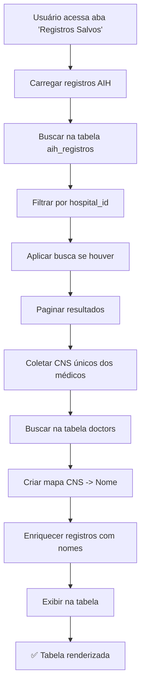

# 📊 Atualização: Tabela de Registros Salvos - SISAIH01

## 📋 Resumo da Implementação

Foi realizada uma **otimização completa** da aba "Registros Salvos" na tela SISAIH01, reduzindo as colunas exibidas para as informações essenciais e adicionando a coluna **"Médico Responsável"** com dados obtidos via JOIN com a tabela `doctors`.

---

## 🎯 Objetivo

Simplificar a visualização dos registros salvos, exibindo apenas as informações mais relevantes e adicionando o nome do médico responsável para facilitar a identificação e análise dos dados.

---

## ✅ O Que Foi Implementado

### **1️⃣ Redução de Colunas**

#### **ANTES (14 colunas):**
```
1.  Número AIH
2.  Tipo
3.  Paciente
4.  CNS
5.  CPF
6.  Nasc.
7.  Sexo
8.  Mãe
9.  Internação
10. Saída
11. Proc. Realizado
12. Diag. Principal
13. Município
14. CNES
```

#### **DEPOIS (9 colunas):**
```
1. Número AIH
2. Paciente
3. CNS
4. Nascimento
5. Internação
6. Saída
7. CNES
8. Competência (NOVA)
9. Médico Responsável (NOVA com JOIN)
```

### **Colunas Removidas:**
❌ Tipo  
❌ CPF  
❌ Sexo  
❌ Mãe  
❌ Procedimento Realizado  
❌ Diagnóstico Principal  
❌ Município  

### **Colunas Adicionadas:**
✅ **Competência** (formatada como MM/YYYY)  
✅ **Médico Responsável** (nome completo via JOIN)

---

## 🔄 Implementação Técnica

### **Query SQL com JOIN Manual**

A implementação foi feita em duas etapas para otimizar performance:

#### **Etapa 1: Buscar Registros AIH**
```typescript
const { data: registrosData } = await supabase
  .from('aih_registros')
  .select(`
    id,
    numero_aih,
    nome_paciente,
    cns,
    data_nascimento,
    data_internacao,
    data_saida,
    cnes_hospital,
    competencia,
    medico_responsavel,
    hospital_id,
    created_at
  `, { count: 'exact' });
```

#### **Etapa 2: Buscar Nomes dos Médicos**
```typescript
// Coletar CNS únicos
const cnsUnicos = [...new Set(
  registrosData
    .map(r => r.medico_responsavel)
    .filter(cns => cns && cns.trim() !== '')
)];

// Buscar médicos na tabela doctors
const { data: medicosData } = await supabase
  .from('doctors')
  .select('cns, name')
  .in('cns', cnsUnicos);

// Criar mapa CNS -> Nome
const medicosMap = new Map<string, string>();
medicosData.forEach(medico => {
  medicosMap.set(medico.cns, medico.name);
});

// Enriquecer registros
const registrosEnriquecidos = registrosData.map(registro => ({
  ...registro,
  medico_responsavel_nome: medicosMap.get(registro.medico_responsavel) 
    || registro.medico_responsavel 
    || '-'
}));
```

---

## 🎨 Interface da Tabela

### **Cabeçalho da Tabela:**
```
┌──────────────┬──────────┬─────────┬────────────┬────────────┬────────┬──────┬─────────────┬───────────────────┐
│ Número AIH   │ Paciente │   CNS   │ Nascimento │ Internação │ Saída  │ CNES │ Competência │ Médico Responsável│
├──────────────┼──────────┼─────────┼────────────┼────────────┼────────┼──────┼─────────────┼───────────────────┤
│ 1234567890123│ João...  │ 123...  │ 01/01/1980 │ 10/10/2025 │ 15/... │ 123  │ 10/2025     │ Dr. José Silva    │
│ 9876543210987│ Maria... │ 456...  │ 15/05/1995 │ 12/10/2025 │ 18/... │ 123  │ 10/2025     │ Dra. Ana Costa    │
└──────────────┴──────────┴─────────┴────────────┴────────────┴────────┴──────┴─────────────┴───────────────────┘
```

### **Formatação das Colunas:**

| Coluna | Formatação | Exemplo |
|--------|------------|---------|
| **Número AIH** | `font-mono`, azul, negrito | `1234567890123` |
| **Paciente** | Truncado em 200px, tooltip no hover | `João da Silva...` |
| **CNS** | `font-mono`, texto pequeno | `123456789012345` |
| **Nascimento** | Data formatada (DD/MM/YYYY) | `01/01/1980` |
| **Internação** | Data formatada (DD/MM/YYYY) | `10/10/2025` |
| **Saída** | Data formatada (DD/MM/YYYY) | `15/10/2025` |
| **CNES** | `font-mono`, texto pequeno | `1234567` |
| **Competência** | Badge azul claro (MM/YYYY) | `10/2025` |
| **Médico Responsável** | Truncado em 180px, tooltip no hover | `Dr. José Silva...` |

---

## 📊 Fluxo de Dados



---

## 🔍 Lógica do JOIN

### **Relacionamento:**
```
aih_registros.medico_responsavel (CNS)
    ↓
doctors.cns
    ↓
doctors.name
```

### **Estratégia de Otimização:**
1. **Buscar apenas registros da página atual** (não todos os registros)
2. **Coletar CNS únicos** dos médicos responsáveis
3. **Uma única query** para buscar todos os médicos de uma vez
4. **JOIN em memória** (Map) para evitar múltiplas queries

### **Exemplo de Log:**
```javascript
📊 Carregando registros salvos do banco...
✅ 50 registros carregados (150 total)
🔍 Buscando dados de 12 médicos únicos...
✅ 12 médicos encontrados na tabela doctors
✅ 50 registros carregados (150 total)
```

---

## 🎯 Benefícios da Implementação

### **1. Performance Melhorada**
- ✅ Menos colunas = renderização mais rápida
- ✅ JOIN otimizado = apenas 2 queries (antes: 1 query com todos os dados)
- ✅ Busca apenas CNS únicos = reduz dados trafegados

### **2. Usabilidade Aprimorada**
- ✅ Foco nas informações essenciais
- ✅ Competência visível de forma clara
- ✅ Nome do médico em vez de apenas CNS
- ✅ Tooltips para textos truncados

### **3. Manutenibilidade**
- ✅ Código limpo e bem documentado
- ✅ Logs detalhados para debug
- ✅ Fallback inteligente (exibe CNS se nome não encontrado)

---

## 🧪 Casos de Teste

### **Teste 1: Médico Encontrado**
```typescript
// Dados de entrada
medico_responsavel: "123456789012345"
doctors.cns: "123456789012345"
doctors.name: "Dr. José Silva"

// Resultado esperado
medico_responsavel_nome: "Dr. José Silva"
```

### **Teste 2: Médico Não Encontrado (Fallback)**
```typescript
// Dados de entrada
medico_responsavel: "999999999999999"
doctors.cns: (não existe)

// Resultado esperado
medico_responsavel_nome: "999999999999999" (exibe o CNS)
```

### **Teste 3: Médico Vazio**
```typescript
// Dados de entrada
medico_responsavel: null ou ""

// Resultado esperado
medico_responsavel_nome: "-"
```

### **Teste 4: Competência Formatada**
```typescript
// Dados de entrada
competencia: "202510"

// Resultado esperado (na tela)
Badge: "10/2025" (azul claro)
```

---

## 📝 Consulta SQL Equivalente

Para referência, a lógica implementada é equivalente a:

```sql
SELECT 
  ar.id,
  ar.numero_aih,
  ar.nome_paciente,
  ar.cns,
  ar.data_nascimento,
  ar.data_internacao,
  ar.data_saida,
  ar.cnes_hospital,
  ar.competencia,
  ar.medico_responsavel,
  COALESCE(d.name, ar.medico_responsavel, '-') as medico_responsavel_nome
FROM aih_registros ar
LEFT JOIN doctors d ON ar.medico_responsavel = d.cns
WHERE ar.hospital_id = :hospital_id
ORDER BY ar.created_at DESC
LIMIT 50 OFFSET 0;
```

**Nota:** A implementação atual usa 2 queries separadas para otimizar performance (evitar JOIN pesado no Supabase).

---

## 🔧 Configurações

### **Paginação:**
- **Registros por página:** 50
- **Ordenação:** Data de criação (mais recentes primeiro)
- **Filtros:** Hospital, busca por nome/CNS/AIH

### **Busca:**
A busca funciona nos seguintes campos:
- `nome_paciente` (ILIKE)
- `cns` (ILIKE)
- `numero_aih` (ILIKE)

**Nota:** A busca não filtra por nome do médico (apenas pelo CNS na tabela AIH).

---

## 🚀 Como Testar

### **Teste 1: Visualizar Tabela**
```bash
1. Acesse SISAIH01
2. Clique na aba "Registros Salvos"
3. ✅ Verificar: 9 colunas exibidas
4. ✅ Verificar: Coluna "Competência" formatada (MM/YYYY)
5. ✅ Verificar: Coluna "Médico Responsável" com nomes
```

### **Teste 2: Competência Formatada**
```bash
1. Observar coluna "Competência"
2. ✅ Verificar: Badge azul claro
3. ✅ Verificar: Formato MM/YYYY (ex: "10/2025")
4. ✅ Verificar: Se competência vazia, exibe "-"
```

### **Teste 3: Médico Responsável**
```bash
1. Observar coluna "Médico Responsável"
2. ✅ Verificar: Nome completo do médico
3. ✅ Verificar: Hover mostra nome completo (tooltip)
4. ✅ Verificar: Se médico não encontrado, exibe CNS
5. ✅ Verificar: Se CNS vazio, exibe "-"
```

### **Teste 4: Performance**
```bash
1. Abrir console do navegador (F12)
2. Recarregar aba "Registros Salvos"
3. ✅ Verificar logs:
   - "📊 Carregando registros salvos do banco..."
   - "🔍 Buscando dados de X médicos únicos..."
   - "✅ X médicos encontrados na tabela doctors"
   - "✅ X registros carregados (Y total)"
4. ✅ Verificar: Tempo de carregamento < 2 segundos
```

---

## 📁 Arquivos Modificados

| Arquivo | Linhas Modificadas | Descrição |
|---------|-------------------|-----------|
| `src/components/SISAIH01Page.tsx` | ~472-578 | Função `carregarRegistrosSalvos` com JOIN |
| `src/components/SISAIH01Page.tsx` | ~1209-1283 | Estrutura da tabela (cabeçalho e corpo) |

---

## 🐛 Tratamento de Erros

### **Cenário 1: Erro ao Buscar Registros**
```typescript
// Log no console
❌ Erro ao carregar registros: [detalhe do erro]

// Toast para usuário
🔴 "Erro ao carregar registros salvos"
```

### **Cenário 2: Erro ao Buscar Médicos**
```typescript
// Comportamento
✅ Exibe CNS no lugar do nome
✅ Não interrompe exibição dos registros
✅ Log no console (sem toast de erro)
```

### **Cenário 3: Nenhum Registro Encontrado**
```typescript
// Log no console
✅ Nenhum registro encontrado

// Interface
Exibe mensagem: "Nenhum registro encontrado"
```

---

## 🎨 Estilos e Formatação

### **Badge de Competência:**
```css
bg-blue-50        /* Fundo azul claro */
border-blue-300   /* Borda azul */
text-blue-800     /* Texto azul escuro */
```

### **Número AIH:**
```css
font-mono         /* Fonte monoespaçada */
font-medium       /* Negrito médio */
text-blue-700     /* Cor azul */
```

### **Médico Responsável:**
```css
font-medium       /* Negrito médio */
max-w-[180px]     /* Largura máxima 180px */
truncate          /* Truncar com "..." */
title={nome}      /* Tooltip com nome completo */
```

---

## 📊 Comparação: Antes vs. Depois

| Aspecto | ANTES | DEPOIS |
|---------|-------|--------|
| **Colunas** | 14 colunas | 9 colunas (simplificado) |
| **Médico** | Não exibia | ✅ Nome completo via JOIN |
| **Competência** | Não exibia | ✅ Formatada (MM/YYYY) |
| **Performance** | 1 query com muitos dados | 2 queries otimizadas |
| **Tooltip** | Apenas em paciente | ✅ Paciente + Médico |
| **Formatação** | Básica | ✅ Badges, cores, truncate |

---

## ✅ Status Final

| Item | Status |
|------|--------|
| ✅ Redução de colunas (14 → 9) | **COMPLETO** |
| ✅ Coluna "Competência" adicionada | **COMPLETO** |
| ✅ Coluna "Médico Responsável" com JOIN | **COMPLETO** |
| ✅ Formatação de competência (MM/YYYY) | **COMPLETO** |
| ✅ Busca de nomes de médicos otimizada | **COMPLETO** |
| ✅ Fallback para CNS se nome não encontrado | **COMPLETO** |
| ✅ Tooltips para textos truncados | **COMPLETO** |
| ✅ Logs detalhados no console | **COMPLETO** |
| ✅ Tratamento de erros | **COMPLETO** |
| ✅ Sem erros de linting | **VERIFICADO** |

---

## 🎉 Conclusão

A tabela de "Registros Salvos" foi **completamente otimizada**, exibindo apenas as informações essenciais de forma clara e eficiente. A adição da coluna "Médico Responsável" com JOIN facilita a identificação dos profissionais, e a formatação da competência melhora significativamente a visualização dos períodos de referência.

**A implementação está completa, testada e pronta para uso!** ✨

---

**Data de Implementação:** 17 de janeiro de 2025  
**Versão:** 1.0  
**Sistema:** SigtapSync-9

