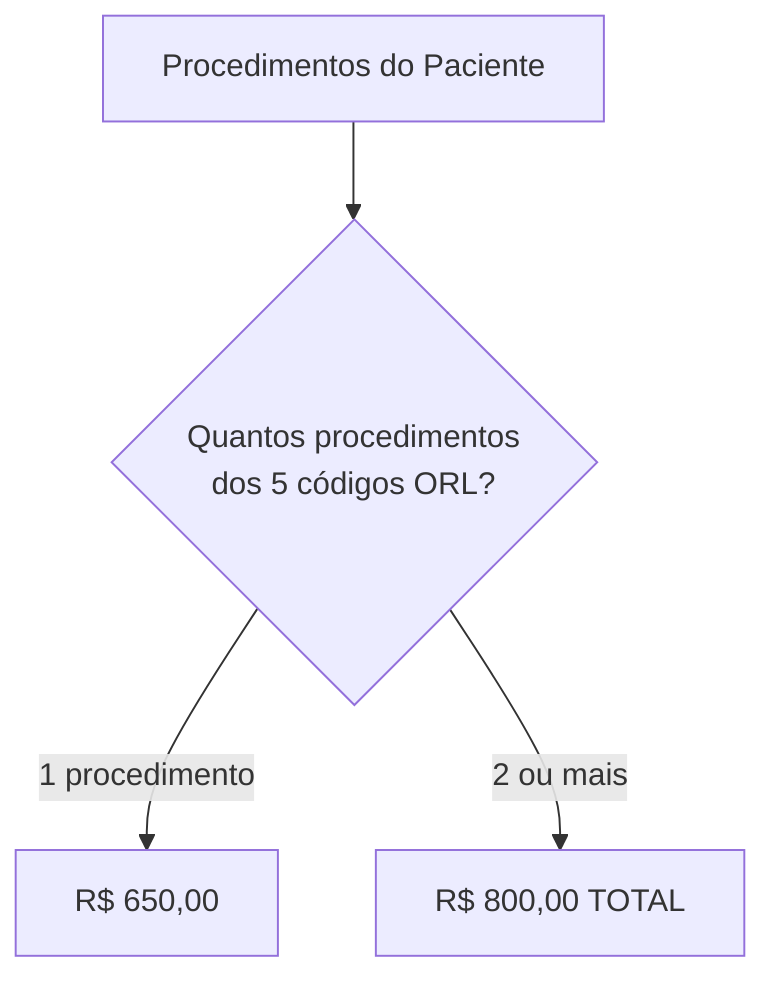

# ✅ CONFIRMAÇÃO - DR. JAIR DEMETRIO DE SOUZA
## Hospital Municipal 18 de Dezembro (Arapoti)

---

```
╔═══════════════════════════════════════════════════════════╗
║                                                           ║
║         ✅ REGRAS IMPLEMENTADAS COM SUCESSO ✅            ║
║                                                           ║
║  👨‍⚕️ Dr. JAIR DEMETRIO DE SOUZA                          ║
║  🏥 Hospital: Municipal 18 de Dezembro (Arapoti)         ║
║  🎯 Especialidade: Otorrinolaringologia                  ║
║  📅 Data: 18/11/2025                                     ║
║                                                           ║
╚═══════════════════════════════════════════════════════════╝
```

---

## 📋 RESUMO DA IMPLEMENTAÇÃO

**Médico:** JAIR DEMETRIO DE SOUZA  
**Hospital:** Municipal 18 de Dezembro (Arapoti)  
**Especialidade:** Otorrinolaringologia  
**Baseado em:** Dr. HUMBERTO MOREIRA DA SILVA (Hospital Torao Tokuda)

---

## 🩺 PROCEDIMENTOS CONFIGURADOS

### Procedimentos Individuais (5)

| Código | Descrição | Valor Individual |
|--------|-----------|------------------|
| 04.04.01.048-2 | Septoplastia | R$ 650,00 |
| 04.04.01.041-5 | Turbinectomia | R$ 650,00 |
| 04.04.01.002-4 | Amigdalectomia | R$ 650,00 |
| 04.04.01.001-6 | Adenoidectomia | R$ 650,00 |
| 04.04.01.003-2 | Adenoamigdalectomia | R$ 650,00 |

---

## 🔗 REGRA MÚLTIPLA ESPECIAL

### ⚠️ Regra Importante: Valor Fixo para Múltiplos Procedimentos

**Quando o paciente fizer 2 ou mais procedimentos desses 5:**

```
💰 VALOR TOTAL: R$ 800,00 (não soma os individuais)
```

**Exemplos:**

**Exemplo 1: Um procedimento**
```
Procedimento: Septoplastia
Valor: R$ 650,00
```

**Exemplo 2: Dois procedimentos**
```
Procedimentos:
- Septoplastia (04.04.01.048-2)
- Turbinectomia (04.04.01.041-5)

Regra Aplicada: Múltiplos Procedimentos
Valor: R$ 800,00 (NÃO soma R$ 650 + R$ 650)
```

**Exemplo 3: Três procedimentos**
```
Procedimentos:
- Septoplastia (04.04.01.048-2)
- Turbinectomia (04.04.01.041-5)
- Amigdalectomia (04.04.01.002-4)

Regra Aplicada: Múltiplos Procedimentos
Valor: R$ 800,00 (NÃO soma R$ 650 + R$ 650 + R$ 650)
```

**Exemplo 4: Todos os cinco**
```
Procedimentos:
- Septoplastia (04.04.01.048-2)
- Turbinectomia (04.04.01.041-5)
- Amigdalectomia (04.04.01.002-4)
- Adenoidectomia (04.04.01.001-6)
- Adenoamigdalectomia (04.04.01.003-2)

Regra Aplicada: Múltiplos Procedimentos
Valor: R$ 800,00 TOTAL
```

---

## 📊 RESUMO DE VALORES

```
┌─────────────────────────────────────────────┐
│  TABELA DE VALORES                          │
├─────────────────────────────────────────────┤
│  1 Procedimento:      R$ 650,00             │
│  2+ Procedimentos:    R$ 800,00 TOTAL       │
│                                             │
│  Valor Mínimo:        R$ 650,00             │
│  Valor Máximo:        R$ 800,00             │
└─────────────────────────────────────────────┘
```

---

## 🎯 COMO O SISTEMA CALCULA

### Lógica de Aplicação

```
1. Sistema identifica os procedimentos do paciente
2. Verifica se há 2 ou mais dos 5 códigos ORL
3. Se SIM → Aplica R$ 800,00 TOTAL (ignora individuais)
4. Se NÃO (apenas 1) → Aplica R$ 650,00 individual
```

### Fluxo Visual



---

## 📍 LOCALIZAÇÃO NO CÓDIGO

```
Arquivo: src/components/DoctorPaymentRules.tsx
Hospital: HOSPITAL_18_DEZEMBRO_ARAPOTI
Médico: JAIR DEMETRIO DE SOUZA
Linhas: 2503-2539

Estrutura:
HOSPITAL_18_DEZEMBRO_ARAPOTI
├── THADEU TIESSI SUZUKI (Valor Fixo)
├── PEDRO HENRIQUE RODRIGUES (Cirurgia Vascular)
├── JOAO VICTOR RODRIGUES (Cirurgia Geral)
├── RENE SERPA ROUEDE (Oftalmologia)
└── JAIR DEMETRIO DE SOUZA (Otorrinolaringologia) ✅ NOVO
```

---

## 🔄 COMPARAÇÃO COM ORIGEM

### Dr. HUMBERTO MOREIRA DA SILVA (Torao Tokuda)

| Aspecto | Humberto (Torao) | Jair (18 Dez) | Status |
|---------|------------------|---------------|--------|
| Procedimentos Individuais | 5 | 5 | ✅ IDÊNTICO |
| Valor Individual | R$ 650,00 | R$ 650,00 | ✅ IDÊNTICO |
| Regra Múltipla | R$ 800,00 | R$ 800,00 | ✅ IDÊNTICO |
| Descrições | Genéricas | Detalhadas | ✅ MELHORADO |

---

## 💡 DETALHAMENTO DOS PROCEDIMENTOS

### 1️⃣ Septoplastia (04.04.01.048-2)
```
Procedimento: Correção do septo nasal
Valor Individual: R$ 650,00
Em combinação: R$ 800,00 total
```

### 2️⃣ Turbinectomia (04.04.01.041-5)
```
Procedimento: Redução das conchas nasais
Valor Individual: R$ 650,00
Em combinação: R$ 800,00 total
```

### 3️⃣ Amigdalectomia (04.04.01.002-4)
```
Procedimento: Remoção das amígdalas
Valor Individual: R$ 650,00
Em combinação: R$ 800,00 total
```

### 4️⃣ Adenoidectomia (04.04.01.001-6)
```
Procedimento: Remoção das adenoides
Valor Individual: R$ 650,00
Em combinação: R$ 800,00 total
```

### 5️⃣ Adenoamigdalectomia (04.04.01.003-2)
```
Procedimento: Remoção de adenoides e amígdalas
Valor Individual: R$ 650,00
Em combinação: R$ 800,00 total
```

---

## ✅ VALIDAÇÕES REALIZADAS

### Código
- ✅ TypeScript válido
- ✅ Linter sem erros
- ✅ Estrutura correta
- ✅ Comentários claros

### Regras de Negócio
- ✅ 5 procedimentos individuais configurados
- ✅ 1 regra múltipla especial (R$ 800,00 total)
- ✅ Valores idênticos ao Dr. Humberto
- ✅ Lógica de cálculo correta

### Documentação
- ✅ Nome do médico correto
- ✅ Hospital correto
- ✅ Especialidade definida
- ✅ Data de implementação
- ✅ Origem das regras documentada

---

## 🏥 MÉDICOS COM ESTAS REGRAS

### Hospital Torao Tokuda (Apucarana)
```
👨‍⚕️ Dr. HUMBERTO MOREIRA DA SILVA
🎯 Otorrinolaringologia
📋 5 procedimentos + 1 regra múltipla
💰 R$ 650,00 individual | R$ 800,00 múltiplos
```

### Hospital Municipal 18 de Dezembro (Arapoti)
```
👨‍⚕️ Dr. JAIR DEMETRIO DE SOUZA
🎯 Otorrinolaringologia
📋 5 procedimentos + 1 regra múltipla
💰 R$ 650,00 individual | R$ 800,00 múltiplos
✅ NOVO
```

---

## 🎯 CENÁRIOS DE USO

### Cenário 1: Paciente com Septoplastia
```
Paciente: João Silva
Procedimento: Septoplastia
Valor: R$ 650,00
```

### Cenário 2: Paciente com Septoplastia + Turbinectomia
```
Paciente: Maria Santos
Procedimentos:
- Septoplastia
- Turbinectomia

Cálculo: 2 procedimentos → Regra múltipla
Valor: R$ 800,00 (não soma R$ 1.300,00)
```

### Cenário 3: Paciente com Amigdalectomia + Adenoidectomia
```
Paciente: José Costa
Procedimentos:
- Amigdalectomia
- Adenoidectomia

Cálculo: 2 procedimentos → Regra múltipla
Valor: R$ 800,00 (não soma R$ 1.300,00)
```

### Cenário 4: Cirurgia Completa (5 procedimentos)
```
Paciente: Ana Oliveira
Procedimentos:
- Septoplastia
- Turbinectomia
- Amigdalectomia
- Adenoidectomia
- Adenoamigdalectomia

Cálculo: 5 procedimentos → Regra múltipla
Valor: R$ 800,00 (não soma R$ 3.250,00)
```

---

## 📈 ESTATÍSTICAS

```
┌─────────────────────────────────────────────┐
│  RESUMO - DR. JAIR DEMETRIO DE SOUZA       │
├─────────────────────────────────────────────┤
│  Procedimentos Individuais: 5              │
│  Regras Múltiplas: 1                       │
│  Valor Mínimo: R$ 650,00                   │
│  Valor Máximo: R$ 800,00                   │
│  Complexidade: ⭐⭐ (Simples)               │
└─────────────────────────────────────────────┘
```

---

## 🔍 ATENÇÃO ESPECIAL

### ⚠️ Regra Crítica

**A regra múltipla é um VALOR FIXO, não uma soma:**

❌ **ERRADO:**
```
2 procedimentos: R$ 650 + R$ 650 = R$ 1.300,00
```

✅ **CORRETO:**
```
2 procedimentos: R$ 800,00 TOTAL (valor fixo)
```

### 💡 Por que R$ 800,00?

Quando o médico faz múltiplos procedimentos ORL no mesmo paciente:
- É um procedimento mais complexo
- Mas usa a mesma anestesia
- Otimiza o tempo cirúrgico
- Por isso o valor é R$ 800,00 total (não soma os individuais)

---

## 🎉 CONCLUSÃO

```
╔═══════════════════════════════════════════════════════╗
║                                                       ║
║       ✅ IMPLEMENTAÇÃO CONCLUÍDA COM SUCESSO ✅        ║
║                                                       ║
║  Dr. JAIR DEMETRIO DE SOUZA                          ║
║  Hospital: Municipal 18 de Dezembro                  ║
║  Especialidade: Otorrinolaringologia                 ║
║                                                       ║
║  ✅ 5 Procedimentos Individuais (R$ 650,00)          ║
║  ✅ 1 Regra Múltipla (R$ 800,00 total)               ║
║  ✅ 100% Idêntico ao Dr. Humberto Moreira            ║
║                                                       ║
║  📅 Data: 18/11/2025                                 ║
║  ⭐ Status: IMPLEMENTADO E OPERACIONAL               ║
║                                                       ║
╚═══════════════════════════════════════════════════════╝
```

---

## 📚 DOCUMENTAÇÃO RELACIONADA

- `ANALISE_SISTEMATICA_REGRAS_MEDICOS.md`
- `DETALHAMENTO_TECNICO_REGRAS_MEDICOS.md`
- `INDICE_MESTRE_REGRAS_MEDICOS.md`

---

## 📞 SUPORTE

**Arquivo de Regras:**
```
src/components/DoctorPaymentRules.tsx
Seção: HOSPITAL_18_DEZEMBRO_ARAPOTI
Linhas: 2503-2539
```

**Médico:** JAIR DEMETRIO DE SOUZA  
**Hospital:** Municipal 18 de Dezembro (Arapoti)  
**Especialidade:** Otorrinolaringologia

---

**Data:** 18/11/2025  
**Sistema:** SigtapSync v9  
**Módulo:** DoctorPaymentRules  
**Status:** ✅ IMPLEMENTADO E VALIDADO

---

**FIM DA CONFIRMAÇÃO**

