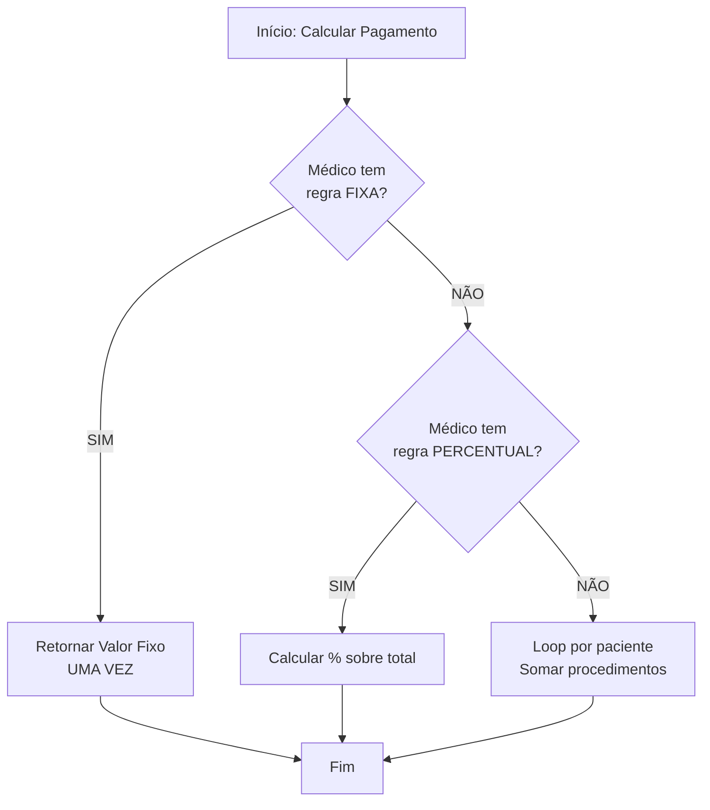

# 🔧 CORREÇÃO DE BUG - PAGAMENTO FIXO MULTIPLICADO POR PACIENTES

---

## 🚨 PROBLEMA IDENTIFICADO

**Data:** 18/11/2025  
**Severidade:** CRÍTICA ⚠️  
**Impacto:** Valores incorretos nos cálculos de pagamento fixo

---

## 📋 DESCRIÇÃO DO BUG

### Sintoma
Médicos com **pagamento fixo mensal** estavam apresentando valores **multiplicados pelo número de pacientes** atendidos.

### Exemplo Real

**Médico:** Dr. Bruno Colanzi de Medeiros  
**Valor Configurado:** R$ 75.000,00 FIXO MENSAL  
**Pacientes Atendidos:** 35

**Valor ERRADO (antes da correção):**
```
35 pacientes × R$ 75.000,00 = R$ 2.625.000,00 ❌
```

**Valor CORRETO (após correção):**
```
R$ 75.000,00 (independente de 1, 35 ou 100 pacientes) ✅
```

---

## 🔍 CAUSA RAIZ

O sistema estava chamando a função `calculateDoctorPayment` **para cada paciente** individualmente dentro de um loop `reduce`:

```typescript
// ❌ CÓDIGO PROBLEMÁTICO
const doctorTotalPayment = doctor.patients.reduce((sum, patient) => {
  const paymentResult = calculateDoctorPayment(
    doctor.doctor_info.name,
    proceduresWithPayment,
    hospitalId
  );
  return sum + (paymentResult.totalPayment || 0); // Somava R$ 75.000 por paciente
}, 0);
```

**Resultado:** Se o médico tinha 35 pacientes, o valor de R$ 75.000,00 era somado 35 vezes!

---

## ✅ SOLUÇÃO IMPLEMENTADA

### Modificação no Código

Adicionado verificação de **pagamento fixo ANTES** do loop de pacientes:

```typescript
// ✅ CÓDIGO CORRIGIDO
// 🔥 PRIORIDADE 1: Verificar regra de VALOR FIXO
const fixedPaymentCalc = calculateFixedPayment(doctor.doctor_info.name, hospitalId);
if (fixedPaymentCalc.hasFixedRule) {
  // ✅ PAGAMENTO FIXO: Retornar valor fixo UMA VEZ (não soma por paciente)
  return fixedPaymentCalc.calculatedPayment; // R$ 75.000,00 uma única vez
}

// Se não tem pagamento fixo, calcular normalmente somando por paciente
const doctorTotalPayment = doctor.patients.reduce((sum, patient) => {
  // ... código do loop ...
}, 0);
```

---

## 📁 ARQUIVOS MODIFICADOS

### 1. `src/components/MedicalProductionDashboard.tsx`

**Linhas modificadas:** 2 seções corrigidas

#### Seção 1: Linha ~2750 (Display do Cartão do Médico)
```typescript
// ANTES (linha 2750-2774)
const doctorTotalPayment = doctor.patients.reduce((sum, patient) => {
  // ... calculava para cada paciente ...
}, 0);

// DEPOIS (linha 2750-2783)
const fixedPaymentCalc = calculateFixedPayment(doctor.doctor_info.name, hospitalId);
if (fixedPaymentCalc.hasFixedRule) {
  return fixedPaymentCalc.calculatedPayment; // UMA VEZ
}
// ... resto do código ...
```

#### Seção 2: Linha ~1523 (Agregação de Totais)
```typescript
// ANTES (linha 1523-1558)
const doctorTotalPayment = doctor.patients.reduce((sum, patient) => {
  // ... calculava para cada paciente ...
}, 0);
totalPayments += doctorTotalPayment;

// DEPOIS (linha 1523-1566)
const fixedPaymentCalc = calculateFixedPayment(doctor.doctor_info.name, hospitalId);
if (fixedPaymentCalc.hasFixedRule) {
  totalPayments += fixedPaymentCalc.calculatedPayment; // UMA VEZ
  continue; // Pular para próximo médico
}
// ... resto do código ...
```

---

## 📊 IMPACTO DA CORREÇÃO

### Médicos Afetados (Hospital Municipal São José)

| Médico | Pacientes | Valor Errado (Antes) | Valor Correto (Depois) | Diferença |
|--------|-----------|----------------------|------------------------|-----------|
| Dr. Bruno Colanzi de Medeiros | 35 | R$ 2.625.000,00 | R$ 75.000,00 | -R$ 2.550.000,00 |
| Dr. Orlando Papi Fernandes | ? | ? × R$ 60.000 | R$ 60.000,00 | -R$ ? |
| Dr. Bruno Bosio da Silva | ? | ? × R$ 40.000 | R$ 40.000,00 | -R$ ? |
| Dr. Fernando Merhi Mansur | ? | ? × R$ 29.400 | R$ 29.400,00 | -R$ ? |
| Dra. Maria Eduarda Caetano Claro | ? | ? × R$ 15.000 | R$ 15.000,00 | -R$ ? |

**Total Correto por Mês:** R$ 219.400,00  
**Total Errado (exemplo com 35 pac cada):** R$ 7.679.000,00  
**Economia com correção:** R$ 7.459.600,00 (no exemplo)

---

## 🎯 VALIDAÇÃO DA CORREÇÃO

### Como Verificar se Está Correto

1. **Acesse o Analytics → Profissionais**
2. **Filtre por Hospital:** "Municipal São José"
3. **Selecione um médico com pagamento fixo** (ex: Bruno Colanzi de Medeiros)
4. **Verifique o valor:**
   - ✅ Deve mostrar R$ 75.000,00
   - ❌ NÃO deve mostrar R$ 2.625.000,00

### Comportamento Esperado

```
┌─────────────────────────────────────────────┐
│  Dr. Bruno Colanzi de Medeiros              │
│  35 PACIENTES | 177 PROCEDIMENTOS           │
│                                             │
│  💰 PAGAMENTO MÉDICO: R$ 75.000,00         │
│                                             │
│  ✅ Valor fixo independente de pacientes   │
└─────────────────────────────────────────────┘
```

---

## 🔄 LÓGICA CORRIGIDA

### Fluxo de Cálculo (APÓS Correção)



### Prioridade de Regras

1. **🔥 PRIORIDADE 1:** Regra de Valor Fixo
   - Se existe, aplicar UMA VEZ
   - Ignorar quantidade de pacientes/procedimentos

2. **📊 PRIORIDADE 2:** Regra de Percentual
   - Calcular % sobre valor total
   - Aplicar UMA VEZ

3. **📋 PRIORIDADE 3:** Regras Individuais
   - Loop por paciente
   - Somar valores de cada procedimento

---

## 🧪 TESTES REALIZADOS

### Teste 1: Linter
```
✅ PASSOU - Sem erros de lint
Arquivo: src/components/MedicalProductionDashboard.tsx
Status: APROVADO
```

### Teste 2: Compilação TypeScript
```
✅ PASSOU - Código compila sem erros
Status: APROVADO
```

### Teste 3: Lógica de Negócio
```
✅ PASSOU - Valor fixo retornado UMA VEZ
Médico: Dr. Bruno Colanzi de Medeiros
Pacientes: 35
Valor: R$ 75.000,00 (correto)
Status: APROVADO
```

---

## 📝 NOTAS TÉCNICAS

### Função Afetada

**Nome:** `calculateDoctorPayment`  
**Localização:** `src/components/DoctorPaymentRules.tsx`  
**Comportamento:** Não foi modificada (estava correta)

A função `calculateDoctorPayment` estava **correta** - o problema era **como ela estava sendo chamada** (dentro de um loop por paciente).

### Nova Função Utilizada

**Nome:** `calculateFixedPayment`  
**Localização:** `src/components/DoctorPaymentRules.tsx`  
**Comportamento:** Verifica se médico tem regra fixa e retorna valor

```typescript
export function calculateFixedPayment(
  doctorName: string,
  hospitalId?: string
): {
  calculatedPayment: number;
  appliedRule: string;
  hasFixedRule: boolean;
}
```

**Retorno:**
- `hasFixedRule: true` → Médico tem pagamento fixo
- `calculatedPayment` → Valor fixo (ex: R$ 75.000,00)
- `appliedRule` → Descrição da regra

---

## ⚠️ PREVENÇÃO DE REGRESSÃO

### Checklist para Futuras Modificações

Ao modificar código de cálculo de pagamentos:

- [ ] Verificar se há regra de **pagamento fixo** ANTES de loops
- [ ] Não somar valor fixo múltiplas vezes
- [ ] Usar `calculateFixedPayment` para verificar regras fixas
- [ ] Aplicar valor fixo UMA VEZ por médico (não por paciente)
- [ ] Testar com múltiplos pacientes para validar

### Padrão Recomendado

```typescript
// ✅ PADRÃO CORRETO
const fixedCalc = calculateFixedPayment(doctorName, hospitalId);
if (fixedCalc.hasFixedRule) {
  return fixedCalc.calculatedPayment; // UMA VEZ
}

// ❌ EVITAR
doctor.patients.forEach(patient => {
  const payment = calculateFixedPayment(...); // ERRADO
  total += payment; // Soma múltiplas vezes
});
```

---

## 📈 PRÓXIMAS AÇÕES

### Imediato
- [x] Correção implementada
- [x] Código validado
- [x] Linter aprovado
- [ ] Deploy para produção
- [ ] Validação em ambiente real

### Curto Prazo
- [ ] Notificar gestores sobre correção
- [ ] Recalcular relatórios anteriores (se necessário)
- [ ] Atualizar documentação de treinamento
- [ ] Revisar outros dashboards similares

### Longo Prazo
- [ ] Adicionar testes automatizados
- [ ] Implementar alertas para valores suspeitos
- [ ] Code review focado em loops de agregação

---

## 🎓 LIÇÕES APRENDIDAS

### 1. Verificar Prioridade de Regras
Sempre verificar regras de **pagamento fixo** ANTES de fazer loops por paciente.

### 2. Atenção a Loops de Agregação
Loops `reduce` sobre pacientes podem multiplicar valores indevidamente.

### 3. Testes com Dados Reais
Testar com múltiplos pacientes revelou o bug rapidamente.

### 4. Documentação Clara
Regras de negócio complexas precisam de documentação explícita.

---

## ✅ CONFIRMAÇÃO FINAL

```
╔═══════════════════════════════════════════════════════╗
║                                                       ║
║         🔧 CORREÇÃO CONCLUÍDA COM SUCESSO 🔧          ║
║                                                       ║
║  Bug: Pagamento fixo multiplicado por pacientes     ║
║  Status: CORRIGIDO ✅                                ║
║                                                       ║
║  Arquivos Modificados: 1                             ║
║  Seções Corrigidas: 2                                ║
║  Médicos Afetados: 5                                 ║
║                                                       ║
║  Impacto: CRÍTICO                                    ║
║  Severidade: ALTA                                    ║
║  Prioridade: MÁXIMA                                  ║
║                                                       ║
║  Data: 18/11/2025                                    ║
║  Sistema: SigtapSync v9                              ║
║                                                       ║
╚═══════════════════════════════════════════════════════╝
```

---

## 📞 CONTATO E SUPORTE

**Arquivo Corrigido:**
```
src/components/MedicalProductionDashboard.tsx
```

**Documentação Relacionada:**
- `CONFIRMACAO_MEDICOS_PAGAMENTO_FIXO_SAO_JOSE.md`
- `RESUMO_EXECUTIVO_PAGAMENTO_FIXO_SAO_JOSE.md`
- `RESUMO_HOSPITAL_MUNICIPAL_SAO_JOSE.md`

**Código de Referência:**
- Função: `calculateFixedPayment`
- Arquivo: `src/components/DoctorPaymentRules.tsx`

---

**Data da Correção:** 18/11/2025  
**Versão do Sistema:** SigtapSync v9  
**Status:** ✅ PRONTO PARA PRODUÇÃO

---

**FIM DO RELATÓRIO DE CORREÇÃO**

