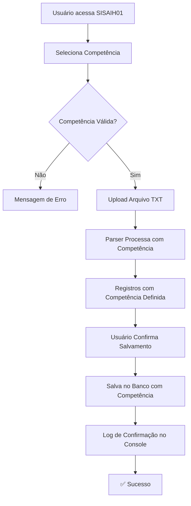

# 📅 Implementação de Seleção de Competência - SISAIH01

## 📋 Resumo da Implementação

Foi implementado um sistema completo de **seleção manual de competência** para os registros de AIH no sistema SISAIH01, permitindo que os usuários definam o mês de referência ao processar arquivos TXT do DATASUS.

---

## 🎯 Objetivo

Anteriormente, a competência era extraída automaticamente do campo `APRES_LOTE` do arquivo TXT. Agora, o usuário pode **selecionar manualmente** a competência antes de processar o arquivo, garantindo maior controle e precisão no registro das AIHs.

---

## ✅ O Que Foi Implementado

### 1️⃣ **Script SQL - Banco de Dados**
**Arquivo:** `database/add_competencia_sisaih01.sql`

#### **Melhorias Implementadas:**
- ✅ Garantia de existência da coluna `competencia VARCHAR(6)` na tabela `aih_registros`
- ✅ Índice otimizado: `idx_aih_registros_competencia`
- ✅ Índice composto: `idx_aih_registros_hospital_competencia` (hospital + competência)
- ✅ **View analítica:** `aih_registros_por_competencia` - estatísticas agrupadas por mês
- ✅ **Função SQL:** `get_competencias_disponiveis()` - lista competências disponíveis com formatação amigável

#### **Como Executar:**
```sql
-- No Supabase SQL Editor
\i database/add_competencia_sisaih01.sql
```

#### **Benefícios:**
- Consultas otimizadas por competência
- Análises agregadas por mês de referência
- Performance melhorada em relatórios executivos

---

### 2️⃣ **Parser - Lógica de Processamento**
**Arquivo:** `src/utils/sisaih01Parser.ts`

#### **Alterações:**
```typescript
// ANTES
export function processarArquivoSISAIH01(conteudo: string): RegistroSISAIH01[]

// DEPOIS
export function processarArquivoSISAIH01(
  conteudo: string, 
  competenciaManual?: string // 🆕 Parâmetro opcional
): RegistroSISAIH01[]
```

#### **Comportamento:**
- Se `competenciaManual` for fornecida → usa o valor selecionado pelo usuário
- Se não for fornecida → usa o valor do campo `APRES_LOTE` do arquivo (comportamento anterior)

#### **Exemplo de Uso:**
```typescript
// Com competência manual
const registros = processarArquivoSISAIH01(conteudoTXT, '202501'); // Janeiro/2025

// Sem competência (extrai do arquivo)
const registros = processarArquivoSISAIH01(conteudoTXT);
```

---

### 3️⃣ **Interface do Usuário (UI)**
**Arquivo:** `src/components/SISAIH01Page.tsx`

#### **Novos Componentes:**
1. **Seleção de Competência (OBRIGATÓRIA)**
   - Dropdown com últimos 12 meses
   - Opção de competência customizada
   - Validação de formato (AAAAMM)
   - Indicadores visuais de competência selecionada

2. **Estados Adicionados:**
```typescript
const [competenciaSelecionada, setCompetenciaSelecionada] = useState<string>('');
const [competenciaCustomizada, setCompetenciaCustomizada] = useState<string>('');
```

#### **Validações Implementadas:**
- ❌ Bloqueia processamento se competência não for selecionada
- ❌ Valida formato de competência customizada (6 dígitos: AAAAMM)
- ✅ Feedback visual em tempo real
- ✅ Mensagens de erro descritivas

#### **Fluxo de Uso:**
```
1. Usuário seleciona competência (ex: "01/2025")
2. Usuário faz upload do arquivo TXT
3. Sistema valida competência
4. Sistema processa arquivo com competência selecionada
5. Registros são salvos no banco com competência correta
```

---

## 📊 Estrutura Visual da UI

### **Seção de Competência**
```
┌─────────────────────────────────────────────────────────┐
│ 📅 Competência (Mês de Referência) [OBRIGATÓRIO]        │
├─────────────────────────────────────────────────────────┤
│ Selecione o mês de referência para as AIHs deste arquivo│
│                                                          │
│ [Dropdown: Selecione a competência...]                  │
│   ├─ 10/2025                                            │
│   ├─ 09/2025                                            │
│   ├─ 08/2025                                            │
│   ├─ ...                                                │
│   └─ 📝 Customizada (Digite abaixo)                     │
│                                                          │
│ ✅ Competência selecionada: 10/2025                     │
└─────────────────────────────────────────────────────────┘
```

---

## 🔄 Fluxo Completo de Dados



---

## 🧪 Como Testar

### **1. Teste Básico - Competência Pré-definida**
```typescript
// Passos:
1. Acesse a tela SISAIH01
2. Selecione competência: "10/2025"
3. Faça upload de um arquivo .txt
4. Verifique log no console: "📅 Competência dos registros: 202510"
5. Salve os registros
6. Verifique no banco: SELECT competencia FROM aih_registros LIMIT 10;
```

### **2. Teste com Competência Customizada**
```typescript
// Passos:
1. Acesse a tela SISAIH01
2. Selecione "📝 Customizada (Digite abaixo)"
3. Digite: "202412" (Dezembro/2024)
4. Faça upload do arquivo
5. Verifique que competência "202412" foi aplicada
```

### **3. Teste de Validação**
```typescript
// Tentativas que DEVEM falhar:
❌ Tentar processar sem selecionar competência
❌ Digitar competência customizada com formato errado: "2024" (4 dígitos)
❌ Digitar competência customizada não numérica: "ABC123"
```

---

## 📝 Logs de Rastreamento

O sistema agora gera logs detalhados:

```javascript
// Ao processar
📅 Processando arquivo com competência: 202510

// Ao salvar
📦 Iniciando salvamento de 150 registros em 2 lotes
🏥 Hospital do usuário: abc-123-def
📅 Competência dos registros: 202510
```

---

## 🔍 Consultas SQL Úteis

### **Ver Registros por Competência**
```sql
SELECT 
  competencia,
  COUNT(*) as total
FROM aih_registros
GROUP BY competencia
ORDER BY competencia DESC;
```

### **Estatísticas por Competência (Usando View)**
```sql
SELECT * FROM aih_registros_por_competencia;
```

### **Listar Competências Disponíveis**
```sql
SELECT * FROM get_competencias_disponiveis();
```

### **Filtrar AIHs de Uma Competência Específica**
```sql
SELECT * 
FROM aih_registros 
WHERE competencia = '202510'
LIMIT 100;
```

---

## 🎨 Melhorias de UX

### **Indicadores Visuais**
- 🟠 **Laranja:** Campo obrigatório pendente
- 🟢 **Verde:** Competência selecionada com sucesso
- 🔴 **Vermelho:** Badge "OBRIGATÓRIO" para destacar importância
- ✅ **Check:** Ícone de confirmação ao lado da competência selecionada

### **Feedback em Tempo Real**
- Exibição imediata da competência formatada (MM/YYYY)
- Validação instantânea de competência customizada
- Mensagens de erro descritivas e contextualizadas

---

## 📦 Arquivos Modificados

| Arquivo | Tipo | Descrição |
|---------|------|-----------|
| `database/add_competencia_sisaih01.sql` | SQL | Script de criação/atualização da estrutura |
| `src/utils/sisaih01Parser.ts` | TypeScript | Parser com suporte a competência manual |
| `src/components/SISAIH01Page.tsx` | React/TSX | Interface de seleção de competência |

---

## 🚀 Como Usar (Passo a Passo)

### **Para Administradores de Banco de Dados:**
```bash
# 1. Executar script SQL no Supabase
Acesse: Supabase Dashboard > SQL Editor
Cole o conteúdo de: database/add_competencia_sisaih01.sql
Execute o script
```

### **Para Usuários Finais:**
```
1. Acesse a tela "SISAIH01"
2. Na seção laranja "Competência (Mês de Referência)":
   - Selecione o mês/ano desejado (ex: 10/2025)
   OU
   - Escolha "Customizada" e digite no formato AAAAMM
3. Faça upload do arquivo .txt do DATASUS
4. Aguarde o processamento
5. Revise os registros processados
6. Clique em "💾 Salvar no Banco de Dados"
7. Confirme o salvamento
8. ✅ Registros salvos com a competência correta!
```

---

## 🔐 Segurança e Validações

### **Validações Implementadas:**
✅ Competência é obrigatória (não permite processamento sem ela)  
✅ Formato validado: exatamente 6 dígitos numéricos (AAAAMM)  
✅ Competência customizada valida formato antes do processamento  
✅ Logs de auditoria registram competência utilizada  

### **Tratamento de Erros:**
- Mensagens claras e contextualizadas
- Bloqueio de processamento em caso de erro
- Console logs detalhados para debug

---

## 📈 Benefícios da Implementação

1. **Controle Total:** Usuário define o mês de referência manualmente
2. **Flexibilidade:** Suporta competências históricas e futuras
3. **Rastreabilidade:** Logs detalhados de qual competência foi usada
4. **Performance:** Índices otimizados para consultas por competência
5. **UX Aprimorada:** Interface intuitiva com validações em tempo real
6. **Análises Precisas:** Views e funções SQL para relatórios por mês

---

## 🐛 Troubleshooting

### **Problema:** "Por favor, selecione a competência antes de processar"
**Solução:** Certifique-se de selecionar uma competência no dropdown laranja antes de fazer upload.

### **Problema:** "Competência customizada inválida"
**Solução:** Use exatamente 6 dígitos no formato AAAAMM (ex: 202501 para janeiro/2025).

### **Problema:** Competência não aparece no banco após salvamento
**Solução:** 
1. Verifique logs no console: `📅 Competência dos registros: ...`
2. Execute script SQL: `database/add_competencia_sisaih01.sql`
3. Confirme que coluna `competencia` existe na tabela

---

## ✨ Próximos Passos (Opcional)

### **Melhorias Futuras Sugeridas:**
1. 📊 **Dashboard de Competências:** Gráfico de AIHs por mês
2. 🔍 **Filtro por Competência:** Na aba "Registros Salvos"
3. 📤 **Export por Competência:** Exportar CSV de um mês específico
4. 🔔 **Alertas:** Notificar se competência for muito antiga/futura
5. 📁 **Histórico:** Listar últimos arquivos processados com suas competências

---

## 📞 Suporte

Para dúvidas ou problemas:
1. Verifique os logs no console do navegador (F12)
2. Revise esta documentação
3. Execute queries SQL de diagnóstico (seção "Consultas SQL Úteis")

---

## 🎉 Conclusão

A implementação foi concluída com sucesso! O sistema agora oferece controle total sobre a competência das AIHs, com uma interface intuitiva, validações robustas e estrutura de banco otimizada.

**Status:** ✅ **IMPLEMENTADO E FUNCIONAL**

---

**Data de Implementação:** 17 de janeiro de 2025  
**Versão:** 1.0  
**Sistema:** SigtapSync-9

